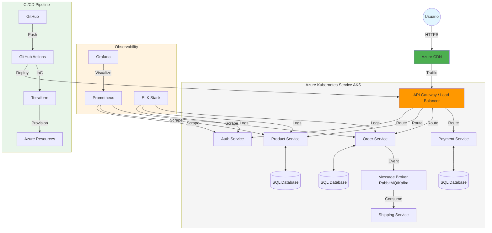
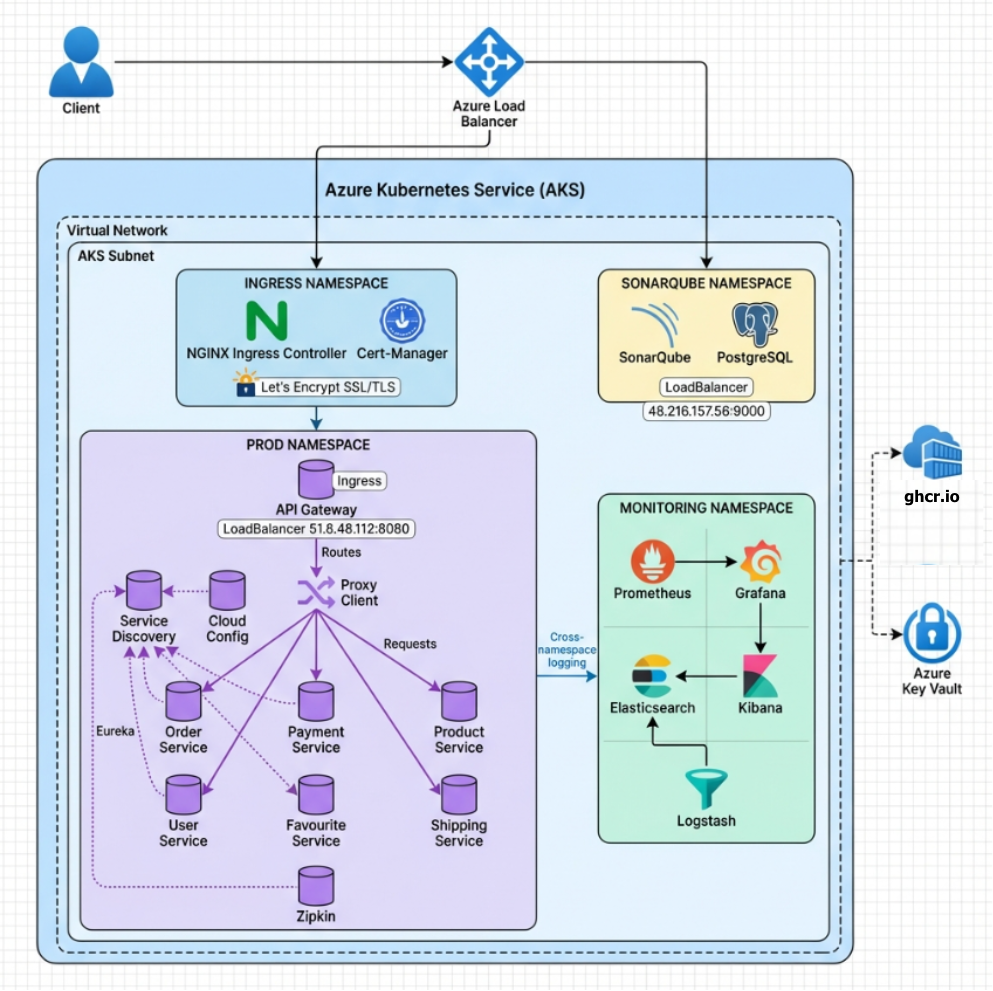

# 📘 Proyecto Final de Ingeniería de Software - E-Commerce Microservices

## 👥 Autores

- 
- 

Bienvenido a la documentación oficial del proyecto final de Ingeniería de Software. Este repositorio contiene la implementación completa de una arquitectura de microservicios para un sistema de E-Commerce, desplegada en Azure utilizando prácticas modernas de DevOps, Infraestructura como Código (IaC) y Observabilidad.

## 🚀 Introducción

Este proyecto demuestra la implementación de un ciclo de vida de desarrollo de software completo (SDLC) utilizando metodologías ágiles, integración y despliegue continuo (CI/CD), y una arquitectura robusta basada en microservicios. El objetivo principal fue migrar una aplicación monolítica o construir desde cero una solución escalable, resiliente y segura.

## 🏗️ Arquitectura General

El sistema está compuesto por múltiples microservicios (Product, Order, User, Payment, Shipping) que se comunican entre sí, orquestados por Kubernetes en Azure (AKS). Utilizamos un API Gateway para la gestión del tráfico y Eureka para el descubrimiento de servicios.

### Diagrama de Arquitectura (Propuesta Inicial)

A continuación se presenta el diagrama conceptual inicial de la arquitectura propuesta:

### Diagrama de Arquitectura Implementada

## 📚 Índice de Documentación

La documentación detallada del proyecto se encuentra dividida en los siguientes módulos:

1.  [**Metodología y Estrategia de Branching**](./docs/01-metodologia-branching.md)
    *   Detalles sobre Kanban, Historias de Usuario y Gitflow.
2.  [**Infraestructura como Código (Terraform)**](./docs/02-infraestructura-terraform.md)
    *   Modularización, multi-ambiente y gestión de estado en Azure.
3.  [**Patrones de Diseño**](./docs/03-patrones-de-diseno.md)
    *   Circuit Breaker, Config Server, API Gateway y más.
4.  [**CI/CD Avanzado**](./docs/04-cicd-avanzado.md)
    *   Pipelines de GitHub Actions, SonarQube, Trivy y despliegues.
5.  [**Estrategia de Pruebas**](./docs/05-pruebas.md)
    *   Unitarias, Integración, E2E, Performance y Seguridad.
6.  [**Gestión de Cambios y Releases**](./docs/06-change-management-releases.md)
    *   Versionamiento semántico y notas de lanzamiento.
7.  [**Observabilidad y Monitoreo**](./docs/07-observabilidad.md)
    *   Prometheus, Grafana, ELK y Tracing distribuido.
8.  [**Seguridad**](./docs/08-seguridad.md)
    *   Análisis de vulnerabilidades, gestión de secretos y RBAC.
9.  [**Costos y Operaciones**](./docs/09-costos-operaciones.md)
    *   Estimación de costos en Azure y manual operativo.

## 🖼️ Galería del Proyecto

### Tablero Kanban

### Pipelines de CI/CD

### Monitoreo en Grafana

---
*Proyecto Final de Ingeniería de Software - 2025*
