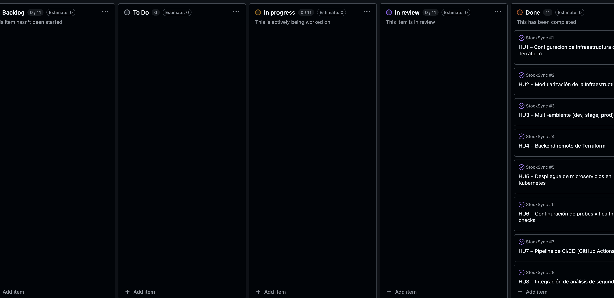

# 01. Metodología Ágil y Estrategia de Branching

Este documento detalla la metodología de trabajo utilizada durante el desarrollo del proyecto y la estrategia de control de versiones implementada para garantizar un flujo de trabajo ordenado y eficiente.

## 📋 Metodología Ágil

Para la gestión del proyecto, adoptamos la metodología **Kanban**, lo que nos permitió visualizar el flujo de trabajo, limitar el trabajo en curso (WIP) y maximizar la eficiencia.

*   **Herramienta:** GitHub Projects (Tablero Kanban).
*   **Enfoque:** Entrega continua y mejora incremental.

### Historias de Usuario (User Stories)

Definimos un backlog con historias de usuario claras para guiar el desarrollo de la infraestructura y el despliegue:

```text
HU1 – Configuración de Infraestructura con Terraform
HU2 – Modularización de la Infraestructura
HU3 – Multi-ambiente (dev, stage, prod)
HU4 – Backend remoto de Terraform
HU5 – Despliegue de microservicios en Kubernetes
HU6 – Configuración de probes y health checks
HU7 – Pipeline de CI/CD (GitHub Actions)
HU8 – Integración de análisis de seguridad y calidad
HU9 – Implementación de pruebas completas
HU10 – Monitoreo y Observabilidad
HU11 – Preparación de la presentación final del proyecto
```

Realizamos una **iteración completa**, asegurando que cada historia de usuario cumpliera con sus criterios de aceptación antes de ser movida a "Done".

### Evidencia del Tablero Kanban


---

## 🌿 Estrategia de Branching

Implementamos una estrategia de branching robusta basada en **Gitflow** adaptado, separando claramente el código de aplicación del código de infraestructura (Ops).

### Branching para Aplicación (Dev)

El flujo de trabajo para el desarrollo de los microservicios es el siguiente:

```text
main (producción)
↑
develop (staging)
↑
feature/<ticket>
hotfix/<issue> → main
```

*   **main:** Rama estable que refleja lo que está en producción. Solo recibe merges desde `develop` (releases) o `hotfix`.
*   **develop:** Rama de integración para el ambiente de staging. Aquí se fusionan las features terminadas.
*   **feature/<ticket>:** Ramas efímeras para desarrollo de nuevas funcionalidades. Se crean desde `develop` y se fusionan de vuelta mediante Pull Requests.
*   **hotfix/<issue>:** Ramas para correcciones críticas en producción.

### Branching para Infraestructura (Ops)

Para el código de Terraform y configuraciones de Kubernetes, utilizamos un flujo paralelo:

```text
ops/main (infra producción)
↑
ops/feature/<cambio>
ops/hotfix/<issue> → ops/main
```

*   **ops/main:** Contiene el estado de la infraestructura de producción.
*   **ops/feature:** Para cambios en la infraestructura (ej. añadir un nuevo recurso en Azure).

### Conventional Commits

Adoptamos la especificación de **Conventional Commits** para mantener un historial de cambios limpio y automatizar la generación de versiones:

*   `feat`: Una nueva funcionalidad.
*   `fix`: Corrección de un bug.
*   `docs`: Cambios en la documentación.
*   `style`: Cambios de formato (espacios, comas, etc).
*   `refactor`: Refactorización de código sin cambios de lógica.
*   `test`: Añadir o corregir pruebas.
*   `chore`: Tareas de mantenimiento (ej. actualización de dependencias).

Ejemplo: `feat(auth): implement JWT validation`
