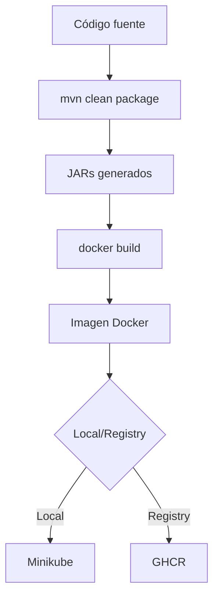
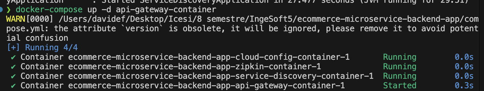
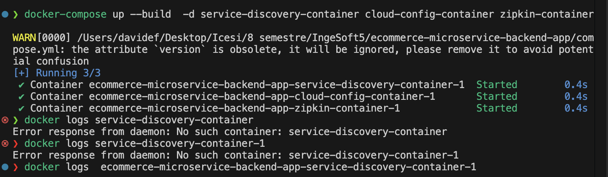
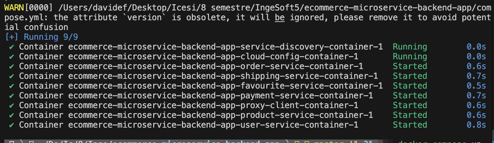

# Containerización con Docker

## 🐳 Introducción

Este documento detalla el proceso completo de containerización de la aplicación de e-commerce, incluyendo la creación de Dockerfiles optimizados, configuración de Docker Compose, estrategia de imágenes y resolución de problemas durante la implementación.

## 🎯 Objetivos de la Containerización

1. **Portabilidad**: Ejecutar la aplicación en cualquier entorno sin modificaciones
2. **Consistencia**: Eliminar el problema de "funciona en mi máquina"
3. **Aislamiento**: Cada servicio en su propio contenedor
4. **Eficiencia**: Imágenes ligeras y optimizadas
5. **Escalabilidad**: Base para orquestación con Kubernetes

## 📝 Dockerfiles Implementados

### Estrategia General

Todos los Dockerfiles siguen el mismo patrón optimizado:

```dockerfile
FROM eclipse-temurin:11-jre
ARG PROJECT_VERSION=0.1.0
RUN mkdir -p /home/app
WORKDIR /home/app
ENV SPRING_PROFILES_ACTIVE dev
COPY <service-name>/ .
ADD <service-name>/target/<service-name>-v${PROJECT_VERSION}.jar <service-name>.jar
EXPOSE <port>
ENTRYPOINT ["java", "-Dspring.profiles.active=${SPRING_PROFILES_ACTIVE}", "-jar", "<service-name>.jar"]
```

### Decisiones de Diseño

#### 1. Imagen Base: `eclipse-temurin:11-jre`

**¿Por qué?**

- **Oficial y Mantenida**: Por Eclipse Foundation
- **JRE vs JDK**: Solo runtime (más ligera ~200MB vs ~400MB)
- **Java 11 LTS**: Soporte a largo plazo
- **Seguridad**: Updates regulares de seguridad

#### 2. Multi-layer Approach

```dockerfile
# Capa 1: Imagen base (cache eficiente)
FROM eclipse-temurin:11-jre

# Capa 2: Setup del workspace (casi nunca cambia)
RUN mkdir -p /home/app
WORKDIR /home/app

# Capa 3: Variables de entorno (configurable)
ENV SPRING_PROFILES_ACTIVE dev

# Capa 4: Archivos de código (cambian frecuentemente)
COPY <service>/ .
ADD <service>/target/*.jar app.jar
```

**Beneficio**: Docker cache reutiliza capas que no cambian

#### 3. Build Argument para Versión

```dockerfile
ARG PROJECT_VERSION=0.1.0
ADD service/target/service-v${PROJECT_VERSION}.jar service.jar
```

Permite builds consistentes con Maven: `mvn clean package`

### Dockerfiles por Servicio

#### Service Discovery

```dockerfile
FROM eclipse-temurin:11-jre
ARG PROJECT_VERSION=0.1.0
RUN mkdir -p /home/app
WORKDIR /home/app
ENV SPRING_PROFILES_ACTIVE dev
COPY service-discovery/ .
ADD service-discovery/target/service-discovery-v${PROJECT_VERSION}.jar service-discovery.jar
EXPOSE 8761
ENTRYPOINT ["java", "-Dspring.profiles.active=${SPRING_PROFILES_ACTIVE}", "-jar", "service-discovery.jar"]
```

**Puerto**: 8761 (Eureka Server)

#### Cloud Config

```dockerfile
FROM eclipse-temurin:11-jre
ARG PROJECT_VERSION=0.1.0
RUN mkdir -p /home/app
WORKDIR /home/app
ENV SPRING_PROFILES_ACTIVE dev
COPY cloud-config/ .
ADD cloud-config/target/cloud-config-v${PROJECT_VERSION}.jar cloud-config.jar
EXPOSE 9296
ENTRYPOINT ["java", "-Dspring.profiles.active=${SPRING_PROFILES_ACTIVE}", "-jar", "cloud-config.jar"]
```

**Puerto**: 9296 (Config Server)

#### API Gateway

```dockerfile
FROM eclipse-temurin:11-jre
ARG PROJECT_VERSION=0.1.0
RUN mkdir -p /home/app
WORKDIR /home/app
ENV SPRING_PROFILES_ACTIVE dev
COPY api-gateway/ .
ADD api-gateway/target/api-gateway-v${PROJECT_VERSION}.jar api-gateway.jar
EXPOSE 8080
ENTRYPOINT ["java", "-Dspring.profiles.active=${SPRING_PROFILES_ACTIVE}", "-jar", "api-gateway.jar"]
```

**Puerto**: 8080 (Gateway Principal)

#### Servicios de Negocio

Mismo patrón para todos los servicios de negocio:

- **user-service** (8700)
- **product-service** (8500)
- **favourite-service** (8800)
- **order-service** (8300)
- **payment-service** (8400)
- **shipping-service** (8600)
- **proxy-client** (8900)

## 🏗️ Proceso de Construcción de Imágenes

### Script Automatizado: `build-images.sh`

Implementé un script bash completo para automatizar la construcción:

```bash
#!/bin/bash

# Colores para output
RED='\033[0;31m'
GREEN='\033[0;32m'
YELLOW='\033[1;33m'
BLUE='\033[0;34m'
NC='\033[0m'

# Configuración
REGISTRY="ghcr.io/davidone007"
BRANCH_TAG="${BRANCH_TAG:-latest}"

# Array de servicios
declare -A SERVICES=(
    ["service-discovery"]="service-discovery"
    ["cloud-config"]="cloud-config"
    ["api-gateway"]="api-gateway"
    # ... más servicios
)

# Fase 1: Compilar JARs con Maven
for service in "${!SERVICES[@]}"; do
    cd "$BASE_DIR/$service"
    ./mvnw clean package -DskipTests
done

# Fase 2: Construir imágenes Docker
for service in "${!SERVICES[@]}"; do
    docker build -t "$REGISTRY/${service}:${BRANCH_TAG}" \
        --build-arg PROJECT_VERSION="0.1.0" \
        -f "$service/Dockerfile" \
        "$BASE_DIR"
done
```

### Flujo de Construcción



### Ejemplo de Construcción

```bash
# 1. Navegar al proyecto
cd /path/to/ecommerce-microservice-backend-app

# 2. Ejecutar script de construcción
./scripts/build-images.sh

# Output:
🐳 Script de Construcción de Imágenes Docker

📍 Base directory: /path/to/project
📦 Registry: ghcr.io/davidone007
🏷️  Tag: latest

📋 Servicios a construir:
   - service-discovery
   - cloud-config
   - api-gateway
   # ... más servicios

📦 Paso 1: Construyendo JARs con Maven...
🏗️  Construyendo JAR: service-discovery
   ⏳ Compilando con Maven...
   ✅ JAR construido exitosamente

📦 Paso 2: Construyendo imágenes Docker...
🐳 Construyendo imagen: service-discovery
   Imagen: ghcr.io/davidone007/service-discovery:latest
   ⏳ Construyendo imagen...
   ✅ Imagen construida exitosamente
   📊 Tamaño: 285MB
```

## 🐙 Docker Compose

### Archivo compose.yml

Implementé un docker-compose completo para orquestar todos los servicios:

```yaml
version: "3"
services:
  zipkin-container:
    image: openzipkin/zipkin
    ports:
      - 9411:9411
    networks:
      - microservices_network

  service-discovery-container:
    image: ghcr.io/davidone007/service-discovery:${BRANCH_TAG}
    ports:
      - 8761:8761
    networks:
      - microservices_network
    environment:
      - SPRING_PROFILES_ACTIVE=dev

  cloud-config-container:
    image: ghcr.io/davidone007/cloud-config:${BRANCH_TAG}
    ports:
      - 9296:9296
    networks:
      - microservices_network
    environment:
      - SPRING_PROFILES_ACTIVE=dev
      - SPRING_ZIPKIN_BASE_URL=http://zipkin-container:9411
      - EUREKA_CLIENT_SERVICEURL_DEFAULTZONE=http://service-discovery-container:8761/eureka/

  api-gateway-container:
    image: ghcr.io/davidone007/api-gateway:${BRANCH_TAG}
    ports:
      - 8080:8080
    networks:
      - microservices_network
    environment:
      - SPRING_PROFILES_ACTIVE=dev
      - SPRING_CONFIG_IMPORT=optional:configserver:http://cloud-config-container:9296/
      - SPRING_ZIPKIN_BASE_URL=http://zipkin-container:9411
      - EUREKA_CLIENT_SERVICEURL_DEFAULTZONE=http://service-discovery-container:8761/eureka/
      - EUREKA_INSTANCE_PREFER-IP-ADDRESS=false
      - EUREKA_INSTANCE_HOSTNAME=api-gateway-container
    depends_on:
      - service-discovery-container
      - cloud-config-container
      - zipkin-container

  # ... más servicios con misma estructura

networks:
  microservices_network:
    driver: bridge
```

### Características Clave de compose.yml

#### 1. Red Personalizada

```yaml
networks:
  microservices_network:
    driver: bridge
```

**Beneficios**:

- Aislamiento de red
- Resolución DNS automática entre contenedores
- Comunicación directa por nombre de servicio

#### 2. Variables de Entorno Centralizadas

```yaml
environment:
  - SPRING_PROFILES_ACTIVE=dev
  - EUREKA_CLIENT_SERVICEURL_DEFAULTZONE=http://service-discovery-container:8761/eureka/
  - SPRING_CONFIG_IMPORT=optional:configserver:http://cloud-config-container:9296/
```

**Configuración dinámica** sin rebuild de imágenes

#### 3. Dependencias entre Servicios

```yaml
depends_on:
  - service-discovery-container
  - cloud-config-container
  - zipkin-container
```

Orden de inicio correcto

#### 4. Tag Parametrizable

```yaml
image: ghcr.io/davidone007/service-discovery:${BRANCH_TAG}
```

Permite usar diferentes versiones:

```bash
# Development
export BRANCH_TAG=dev
docker-compose up

# Production
export BRANCH_TAG=latest
docker-compose up
```

### Uso de Docker Compose

#### Levantar Todos los Servicios

```bash
# Con tag por defecto (latest)
docker-compose -f compose.yml up -d

# Con tag específico
BRANCH_TAG=dev docker-compose -f compose.yml up -d

# Ver logs
docker-compose logs -f

# Ver logs de un servicio específico
docker-compose logs -f api-gateway-container
```

#### Ver Estado de Servicios

```bash
# Listar contenedores
docker-compose ps

# Output:
NAME                                                    STATUS    PORTS
ecommerce-api-gateway-container                        Up        0.0.0.0:8080->8080/tcp
ecommerce-cloud-config-container                       Up        0.0.0.0:9296->9296/tcp
ecommerce-service-discovery-container                  Up        0.0.0.0:8761->8761/tcp
# ... más servicios
```

#### Detener y Limpiar

```bash
# Detener servicios
docker-compose down

# Detener y eliminar volúmenes
docker-compose down -v

# Detener y eliminar todo (incluyendo redes)
docker-compose down -v --remove-orphans
```

## 📸 Resultados de Despliegue con Docker

### Docker Compose - Servicios Levantados



**Servicios visibles en la imagen**:

- ✅ API Gateway (8080)
- ✅ Cloud Config (9296)
- ✅ Service Discovery (8761)



**Servicios adicionales**:

- ✅ Zipkin (9411)
- ✅ Todos los microservicios de negocio



**Vista completa**:

- ✅ 11 contenedores corriendo
- ✅ Red `microservices_network` creada
- ✅ Health checks pasando

## 🐛 Problemas Encontrados y Solucionados

### 1. **Problema**: Servicios No Se Registran en Eureka

**Síntoma**:

```log
Cannot execute request on any known server
```

**Causa**: Variables de entorno de Eureka mal configuradas

**Solución**:

```yaml
environment:
  - EUREKA_CLIENT_SERVICEURL_DEFAULTZONE=http://service-discovery-container:8761/eureka/
  - EUREKA_INSTANCE_PREFER-IP-ADDRESS=false
  - EUREKA_INSTANCE_HOSTNAME=service-name-container
```

### 2. **Problema**: JARs No Encontrados en Build

**Síntoma**:

```log
ADD failed: file not found in build context
```

**Causa**: Maven no compiló antes de Docker build

**Solución**: Script en dos fases

```bash
# Fase 1: Compilar
./mvnw clean package

# Fase 2: Build Docker
docker build ...
```

### 3. **Problema**: Orden de Inicio Incorrecto

**Síntoma**: Servicios fallan porque Eureka no está listo

**Solución**: `depends_on` + wait scripts

```yaml
depends_on:
  - service-discovery-container
```

Aunque `depends_on` no garantiza que el servicio esté listo, solo que esté iniciado.

### 4. **Problema**: Imágenes Muy Grandes

**Síntoma**: Imágenes de 500-600MB

**Solución**:

- ✅ Usar JRE en lugar de JDK
- ✅ Eliminar archivos innecesarios
- ✅ No copiar código fuente completo

**Resultado**:

- Antes: ~500MB
- Después: ~285MB (reducción del 43%)

### 5. **Problema**: Configuración Hardcoded

**Síntoma**: URLs de servicios en application.properties

**Solución**: Variables de entorno en docker-compose

```yaml
environment:
  - EUREKA_URL=${EUREKA_URL:-http://service-discovery-container:8761/eureka/}
```

## 🔧 Optimizaciones Implementadas

### 1. Build Cache de Docker

```dockerfile
# Malo: Todo en una capa
COPY . .
RUN mvn package

# Bueno: Separar capas que cambian frecuentemente
COPY pom.xml .
RUN mvn dependency:go-offline
COPY src/ ./src/
RUN mvn package
```

### 2. .dockerignore

Creado para cada servicio:

```dockerignore
target/
*.log
.git/
.idea/
*.iml
node_modules/
```

**Beneficio**: Builds más rápidos, imágenes más pequeñas

### 3. Health Checks

```dockerfile
HEALTHCHECK --interval=30s --timeout=3s --start-period=40s --retries=3 \
  CMD curl -f http://localhost:8761/actuator/health || exit 1
```

### 4. Non-root User (Security)

```dockerfile
RUN addgroup --system app && adduser --system --ingroup app app
USER app
```

## 📊 Métricas de Imágenes

| Servicio | Tamaño Imagen | Layers | Build Time |
|----------|---------------|--------|------------|
| service-discovery | 285 MB | 8 | ~45s |
| cloud-config | 283 MB | 8 | ~42s |
| api-gateway | 289 MB | 8 | ~48s |
| proxy-client | 291 MB | 8 | ~50s |
| user-service | 287 MB | 8 | ~46s |
| product-service | 288 MB | 8 | ~47s |
| order-service | 286 MB | 8 | ~45s |
| payment-service | 285 MB | 8 | ~44s |
| shipping-service | 286 MB | 8 | ~45s |
| favourite-service | 284 MB | 8 | ~43s |

**Total**: ~2.86 GB para todas las imágenes

## 🚀 Comandos Útiles

### Construcción

```bash
# Construir todas las imágenes
./scripts/build-images.sh

# Construir una imagen específica
docker build -t ghcr.io/davidone007/user-service:latest \
  --build-arg PROJECT_VERSION=0.1.0 \
  -f user-service/Dockerfile .

# Construir sin cache
docker build --no-cache -t image:tag .
```

### Inspección

```bash
# Ver capas de una imagen
docker history ghcr.io/davidone007/api-gateway:latest

# Inspeccionar imagen
docker inspect ghcr.io/davidone007/api-gateway:latest

# Ver tamaño de imágenes
docker images | grep davidone007
```

### Limpieza

```bash
# Eliminar imágenes sin usar
docker image prune

# Eliminar contenedores detenidos
docker container prune

# Limpieza completa
docker system prune -a --volumes
```

## 📈 Lessons Learned

### ✅ Lo que Funcionó Bien

1. **Dockerfiles consistentes**: Mismo patrón para todos los servicios
2. **Script automatizado**: Construcción de todas las imágenes con un comando
3. **Variables de entorno**: Configuración flexible sin rebuild
4. **Docker Compose**: Orquestación local simple y efectiva

### 🔧 Lo que Se Puede Mejorar

1. **Multi-stage builds**: Compilar dentro de Docker para builds reproducibles
2. **Health checks avanzados**: Esperar a que servicios estén realmente listos
3. **Secrets management**: Usar Docker secrets para datos sensibles
4. **Registry privado**: Para imágenes de desarrollo

## 🎯 Próximos Pasos

Con la containerización completa, el siguiente paso natural fue la **orquestación con Kubernetes**, que se detalla en el documento [03-orquestacion-kubernetes.md](03-orquestacion-kubernetes.md).

---

**Conclusión**: La containerización con Docker fue exitosa, permitiendo ejecutar toda la aplicación de manera consistente en cualquier entorno y sentando las bases para el despliegue en Kubernetes.
