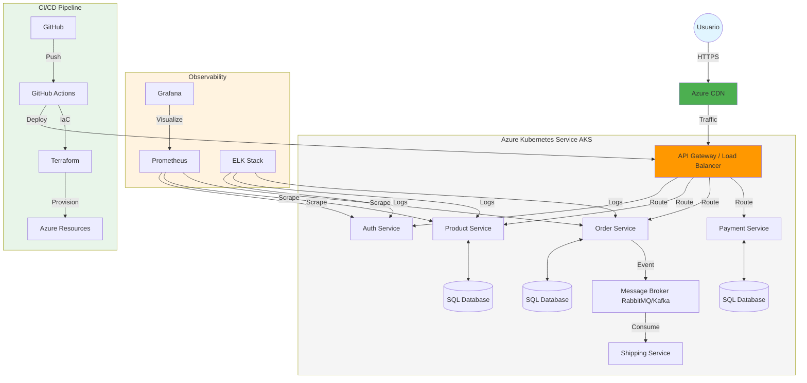
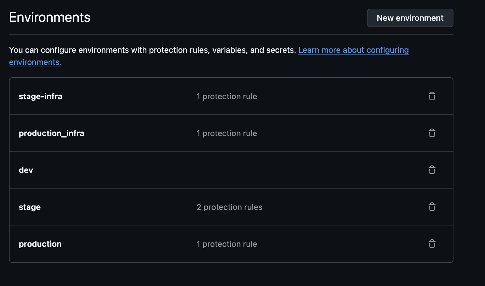

# 02. Infraestructura como Código (Terraform)

La infraestructura del proyecto ha sido aprovisionada y gestionada en su totalidad utilizando **Terraform**, siguiendo las mejores prácticas de **Infraestructura como Código (IaC)**.

## 🏗️ Arquitectura de Infraestructura

La infraestructura se despliega en **Microsoft Azure** y está diseñada para soportar una arquitectura de microservicios escalable.

### Características Principales

*   **Infraestructura Modular:** El código de Terraform se ha dividido en módulos reutilizables (ej. `aks`, `keyvault`, `monitoring`) para facilitar el mantenimiento.
*   **Multi-ambiente:** Soportamos dos entornos principales gestionados por Terraform:
    *   **Stage:** Entorno de pruebas pre-producción.
    *   **Prod:** Entorno de producción.
*   **Backend Remoto:** El estado de Terraform (`terraform.tfstate`) se almacena de forma segura en un Azure Storage Account.

### Dimensionamiento de Clusters (AKS)

Ambos entornos han sido dimensionados para equilibrar costo y rendimiento durante esta fase del proyecto:

| Entorno | Nodos | SKU VM | vCPU | RAM |
| :--- | :--- | :--- | :--- | :--- |
| **Stage** | 2 | Standard_E2_v3 | 2 | 16 GB |
| **Prod** | 2 | Standard_E2_v3 | 2 | 16 GB |

### Reglas de Protección

Para garantizar la estabilidad, implementamos reglas de protección en GitHub y en los entornos de despliegue:

```text
stage-infra → 1 protection rule  
production_infra → 1 protection rule  
dev  
stage → 2 protection rules  
production → 1 protection rule  
```

## 🗺️ Diagrama de Infraestructura (Propuesta)



## 📸 Evidencia de Infraestructura

### Ejecución de Terraform


### Recursos en Azure (Entornos)

