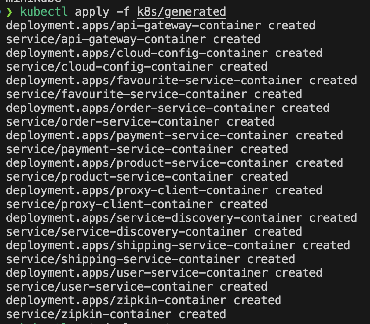
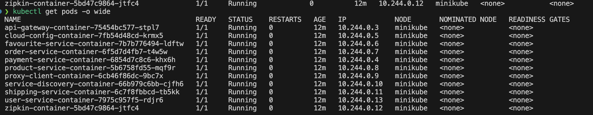
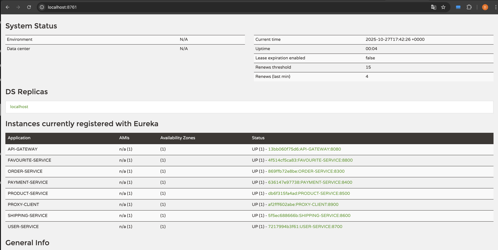

# Orquestación con Kubernetes

## ☸️ Introducción

Este documento detalla la implementación completa de la orquestación con Kubernetes, incluyendo la creación de manifiestos YAML, despliegue en Minikube, scripts de automatización y gestión operativa del clúster.

## 🎯 Objetivos de la Orquestación

1. **Auto-scaling**: Escalado automático basado en métricas
2. **Self-healing**: Reinicio automático de pods fallidos
3. **Rolling updates**: Despliegues sin downtime
4. **Service discovery**: Descubrimiento automático de servicios
5. **Load balancing**: Distribución de carga nativa

## 🏗️ Arquitectura Kubernetes

### Componentes Desplegados

```
ecommerce-k8s-cluster
├── Deployments (11)
│   ├── zipkin-container
│   ├── service-discovery-container
│   ├── cloud-config-container
│   ├── api-gateway-container
│   ├── proxy-client-container
│   ├── user-service-container
│   ├── product-service-container
│   ├── favourite-service-container
│   ├── order-service-container
│   ├── payment-service-container
│   └── shipping-service-container
│
├── Services (11)
│   └── (Mismo listado que Deployments)
│
└── Namespace: default
```

## 📝 Manifiestos de Kubernetes

### Estrategia de Manifiestos

Cada microservicio tiene **dos archivos YAML**:

1. **Deployment**: Define el pod y sus configuraciones
2. **Service**: Expone el deployment en la red del clúster

### Estructura de un Deployment

#### Ejemplo: API Gateway Deployment

```yaml
apiVersion: apps/v1
kind: Deployment
metadata:
  annotations:
    kompose.cmd: kompose convert -o k8s/
    kompose.version: 1.37.0 (HEAD)
  labels:
    io.kompose.service: api-gateway-container
  name: api-gateway-container
spec:
  replicas: 1
  selector:
    matchLabels:
      io.kompose.service: api-gateway-container
  template:
    metadata:
      labels:
        io.kompose.service: api-gateway-container
    spec:
      # Init Containers para esperar dependencias
      initContainers:
        - name: wait-for-dependencies
          image: curlimages/curl:7.85.0
          command:
            - sh
            - -c
            - |
              until curl -sS http://service-discovery-container:8761/ >/dev/null 2>&1; do
                echo "waiting for eureka..."
                sleep 2
              done
              until curl -sS http://cloud-config-container:9296/ >/dev/null 2>&1; do
                echo "waiting for cloud-config..."
                sleep 2
              done
              until curl -sS http://zipkin-container:9411/ >/dev/null 2>&1; do
                echo "waiting for zipkin..."
                sleep 2
              done
      
      # Contenedor principal
      containers:
        - name: api-gateway-container
          image: ghcr.io/davidone007/api-gateway:${BRANCH_TAG}
          imagePullPolicy: IfNotPresent
          ports:
            - containerPort: 8080
              protocol: TCP
          env:
            - name: EUREKA_CLIENT_SERVICEURL_DEFAULTZONE
              value: http://service-discovery-container:8761/eureka/
            - name: EUREKA_INSTANCE_HOSTNAME
              value: api-gateway-container
            - name: EUREKA_INSTANCE_PREFER-IP-ADDRESS
              value: "false"
            - name: SPRING_CLOUD_GATEWAY_DISCOVERY_LOCATOR_ENABLED
              value: "false"
            - name: SPRING_CLOUD_GATEWAY_DISCOVERY_LOCATOR_LOWER-CASE-SERVICE-ID
              value: "true"
            - name: SPRING_CONFIG_IMPORT
              value: optional:configserver:http://cloud-config-container:9296/
            - name: SPRING_PROFILES_ACTIVE
              value: dev
            - name: SPRING_ZIPKIN_BASE_URL
              value: http://zipkin-container:9411
      restartPolicy: Always
```

#### Características Clave del Deployment

**1. Init Containers**

```yaml
initContainers:
  - name: wait-for-dependencies
    image: curlimages/curl:7.85.0
    command:
      - sh
      - -c
      - |
        until curl -sS http://service-discovery-container:8761/ >/dev/null 2>&1; do
          echo "waiting for eureka..."
          sleep 2
        done
```

**Propósito**: Esperar a que los servicios dependientes estén disponibles antes de iniciar

**2. Image Pull Policy**

```yaml
imagePullPolicy: IfNotPresent
```

**Importante para Minikube**: Usa imágenes locales en lugar de intentar descargarlas

**3. Variables de Entorno**

Configuración completa mediante environment variables

### Estructura de un Service

#### Ejemplo: API Gateway Service

```yaml
apiVersion: v1
kind: Service
metadata:
  annotations:
    kompose.cmd: kompose convert -o k8s/
    kompose.version: 1.37.0 (HEAD)
  labels:
    io.kompose.service: api-gateway-container
  name: api-gateway-container
spec:
  type: ClusterIP
  ports:
    - name: "8080"
      port: 8080
      targetPort: 8080
      protocol: TCP
  selector:
    io.kompose.service: api-gateway-container
```

#### Tipos de Service

**ClusterIP** (usado para todos):

- Accesible solo dentro del clúster
- Ideal para comunicación interna entre microservicios
- Acceso externo via port-forward

**Alternativas**:

- `NodePort`: Expone en un puerto del nodo
- `LoadBalancer`: Requiere proveedor cloud (AWS, GCP, Azure)

## 🛠️ Scripts de Automatización

### 1. start-minikube.sh

Script para iniciar Minikube con configuración optimizada:

```bash
#!/bin/bash

echo "🚀 Iniciando Minikube..."

# Iniciar Minikube con recursos apropiados
minikube start \
  --cpus=4 \
  --memory=8192 \
  --disk-size=20g \
  --driver=docker

# Habilitar addons útiles
minikube addons enable metrics-server
minikube addons enable dashboard

echo "✅ Minikube iniciado correctamente"
echo ""
echo "📊 Estado del clúster:"
kubectl cluster-info
echo ""
echo "📈 Nodos disponibles:"
kubectl get nodes
```

### 2. build-images.sh

Ya documentado en [02-containerizacion-docker.md](02-containerizacion-docker.md)

### 3. load-images-minikube.sh

Cargar imágenes Docker en el registro de Minikube:

```bash
#!/bin/bash

SERVICES=(
    "service-discovery"
    "cloud-config"
    "api-gateway"
    "proxy-client"
    "user-service"
    "product-service"
    "favourite-service"
    "order-service"
    "payment-service"
    "shipping-service"
)

REGISTRY="ghcr.io/davidone007"
TAG="${1:-latest}"

echo "📦 Cargando imágenes en Minikube..."
echo "🏷️  Tag: $TAG"
echo ""

for service in "${SERVICES[@]}"; do
    IMAGE="${REGISTRY}/${service}:${TAG}"
    echo "⏳ Cargando: $IMAGE"
    
    minikube image load "$IMAGE"
    
    if [ $? -eq 0 ]; then
        echo "✅ $service cargado"
    else
        echo "❌ Error cargando $service"
    fi
    echo ""
done

echo "📊 Imágenes en Minikube:"
minikube image ls | grep davidone007
```

### 4. deploy-k8s.sh

Script principal de despliegue en Kubernetes:

```bash
#!/bin/bash

# Colores
RED='\033[0;31m'
GREEN='\033[0;32m'
YELLOW='\033[1;33m'
BLUE='\033[0;34m'
NC='\033[0m'

BASE_DIR="$(cd "$(dirname "${BASH_SOURCE[0]}")/.." && pwd)"
K8S_DIR="$BASE_DIR/k8s"
BRANCH_TAG="${1:-latest}"

echo -e "${BLUE}🚀 Script de Despliegue en Kubernetes${NC}"
echo ""
echo "📍 Base directory: $BASE_DIR"
echo "🏷️  Branch tag: $BRANCH_TAG"
echo ""

# Validaciones
if [ ! -d "$K8S_DIR" ]; then
    echo -e "${RED}❌ Directorio k8s no encontrado${NC}"
    exit 1
fi

if ! command -v kubectl &> /dev/null; then
    echo -e "${RED}❌ kubectl no está instalado${NC}"
    exit 1
fi

# Crear directorio temporal
TEMP_DIR=$(mktemp -d)
echo "📁 Usando directorio temporal: $TEMP_DIR"

# Procesar archivos YAML
echo -e "${BLUE}📝 Preparando archivos YAML...${NC}"

for yaml_file in "$K8S_DIR"/*.yaml; do
    filename=$(basename "$yaml_file")
    temp_file="$TEMP_DIR/$filename"
    
    # Reemplazar ${BRANCH_TAG}
    sed "s/\${BRANCH_TAG}/$BRANCH_TAG/g" "$yaml_file" > "$temp_file"
    
    # Agregar imagePullPolicy: IfNotPresent
    if grep -q "ghcr.io/davidone007" "$temp_file"; then
        tmp_file="${temp_file}.tmp"
        while IFS= read -r line; do
            echo "$line"
            if [[ "$line" =~ "image: ghcr.io/davidone007" ]]; then
                echo "          imagePullPolicy: IfNotPresent"
            fi
        done < "$temp_file" > "$tmp_file"
        mv "$tmp_file" "$temp_file"
    fi
    
    echo -e "✓ Procesado: $filename"
done

echo ""
echo -e "${BLUE}🚀 Desplegando servicios...${NC}"

# Aplicar manifiestos
kubectl apply -f "$TEMP_DIR"

if [ $? -eq 0 ]; then
    echo -e "${GREEN}✅ Despliegue exitoso${NC}"
else
    echo -e "${RED}❌ Error en el despliegue${NC}"
    rm -rf "$TEMP_DIR"
    exit 1
fi

echo ""
echo -e "${BLUE}📊 Estado de los pods:${NC}"
kubectl get pods -o wide

# Limpiar
rm -rf "$TEMP_DIR"
```

### 5. port-forward-all-services-nohup.sh

Script para habilitar acceso a todos los servicios:

```bash
#!/bin/bash

# Colores
GREEN='\033[0;32m'
BLUE='\033[0;34m'
NC='\033[0m'

BASE_DIR="$(cd "$(dirname "${BASH_SOURCE[0]}")/.." && pwd)"
LOG_DIR="$BASE_DIR/scripts/port-forward-logs"
PID_FILE="$BASE_DIR/scripts/port-forward-pids.txt"

# Crear directorio de logs
mkdir -p "$LOG_DIR"

# Limpiar archivo de PIDs
> "$PID_FILE"

echo -e "${BLUE}🔌 Iniciando port-forwarding para todos los servicios${NC}"
echo ""

# Servicios y sus puertos
declare -A SERVICES=(
    ["service-discovery-container"]="8761"
    ["cloud-config-container"]="9296"
    ["api-gateway-container"]="8080"
    ["proxy-client-container"]="8900"
    ["user-service-container"]="8700"
    ["product-service-container"]="8500"
    ["favourite-service-container"]="8800"
    ["order-service-container"]="8300"
    ["payment-service-container"]="8400"
    ["shipping-service-container"]="8600"
    ["zipkin-container"]="9411"
)

for service in "${!SERVICES[@]}"; do
    PORT="${SERVICES[$service]}"
    LOG_FILE="$LOG_DIR/${service}.log"
    
    echo -e "🔌 Port-forwarding: ${service} -> localhost:${PORT}"
    
    # Iniciar port-forward en background
    nohup kubectl port-forward "svc/${service}" "${PORT}:${PORT}" \
        > "$LOG_FILE" 2>&1 &
    
    PID=$!
    echo "$PID $service $PORT" >> "$PID_FILE"
    
    echo -e "   PID: $PID"
    echo ""
done

echo -e "${GREEN}✅ Port-forwarding iniciado para todos los servicios${NC}"
echo ""
echo "📝 Logs disponibles en: $LOG_DIR"
echo "📋 PIDs guardados en: $PID_FILE"
echo ""
echo "Para detener: ./scripts/stop-port-forward-all-services-nohup.sh"
```

### 6. stop-port-forward-all-services-nohup.sh

```bash
#!/bin/bash

BASE_DIR="$(cd "$(dirname "${BASH_SOURCE[0]}")/.." && pwd)"
PID_FILE="$BASE_DIR/scripts/port-forward-pids.txt"

if [ ! -f "$PID_FILE" ]; then
    echo "❌ No hay port-forwards activos"
    exit 0
fi

echo "🛑 Deteniendo port-forwards..."

while IFS= read -r line; do
    PID=$(echo "$line" | awk '{print $1}')
    SERVICE=$(echo "$line" | awk '{print $2}')
    PORT=$(echo "$line" | awk '{print $3}')
    
    echo "⏳ Deteniendo $SERVICE (PID: $PID, Puerto: $PORT)"
    kill "$PID" 2>/dev/null
    
    if [ $? -eq 0 ]; then
        echo "✅ Detenido"
    else
        echo "⚠️  Proceso no encontrado (ya detenido?)"
    fi
done < "$PID_FILE"

# Limpiar archivo de PIDs
> "$PID_FILE"

echo ""
echo "✅ Todos los port-forwards han sido detenidos"
```

## 🚀 Flujo Completo de Despliegue

### Paso a Paso

```bash
# 1. Iniciar Minikube
./scripts/start-minikube.sh

# Output:
🚀 Iniciando Minikube...
✅ Minikube iniciado correctamente
📊 Estado del clúster:
Kubernetes control plane is running at https://127.0.0.1:xxxxx

# 2. Construir imágenes Docker
./scripts/build-images.sh

# 3. Cargar imágenes en Minikube
./scripts/load-images-minikube.sh latest

# Output:
📦 Cargando imágenes en Minikube...
⏳ Cargando: ghcr.io/davidone007/service-discovery:latest
✅ service-discovery cargado
# ... más servicios

# 4. Desplegar en Kubernetes
./scripts/deploy-k8s.sh latest

# Output:
🚀 Script de Despliegue en Kubernetes
📝 Preparando archivos YAML...
✓ Procesado: api-gateway-container-deployment.yaml
# ... más archivos
🚀 Desplegando servicios...
deployment.apps/api-gateway-container created
service/api-gateway-container created
# ... más recursos
✅ Despliegue exitoso

# 5. Verificar despliegue
kubectl get pods

# Output esperado:
NAME                                          READY   STATUS    RESTARTS   AGE
api-gateway-container-xxxxxxxx-xxxxx         1/1     Running   0          2m
cloud-config-container-xxxxxxxx-xxxxx        1/1     Running   0          2m
service-discovery-container-xxxxxxxx-xxxxx   1/1     Running   0          2m
# ... más pods

# 6. Habilitar port-forwarding
./scripts/port-forward-all-services-nohup.sh

# Output:
🔌 Iniciando port-forwarding para todos los servicios
🔌 Port-forwarding: api-gateway-container -> localhost:8080
   PID: 12345
# ... más servicios
✅ Port-forwarding iniciado para todos los servicios
```

## 📸 Capturas del Despliegue

### Kubectl Apply - Despliegue Exitoso



**Recursos creados**:

- ✅ 11 Deployments
- ✅ 11 Services
- ✅ Sin errores

### Kubectl Get Pods - Todos Corriendo



**Estado**:

- ✅ 11/11 pods en estado `Running`
- ✅ READY: 1/1 para todos
- ✅ 0 restarts
- ✅ Menos de 5 minutos de uptime

## 🔍 Comandos de Verificación

### Ver Estado General

```bash
# Pods
kubectl get pods
kubectl get pods -o wide  # Con más detalles

# Deployments
kubectl get deployments

# Services
kubectl get svc

# Todo junto
kubectl get all
```

### Ver Logs

```bash
# Logs en tiempo real
kubectl logs -f pod/api-gateway-container-xxxxx

# Últimas 100 líneas
kubectl logs --tail=100 pod/api-gateway-container-xxxxx

# Logs de init container
kubectl logs pod/api-gateway-container-xxxxx -c wait-for-dependencies
```

### Describir Recursos

```bash
# Detalles de un pod
kubectl describe pod api-gateway-container-xxxxx

# Detalles de un deployment
kubectl describe deployment api-gateway-container

# Detalles de un service
kubectl describe svc api-gateway-container
```

### Ejecutar Comandos en Pods

```bash
# Shell interactivo
kubectl exec -it pod/api-gateway-container-xxxxx -- /bin/sh

# Comando único
kubectl exec pod/api-gateway-container-xxxxx -- curl localhost:8080/actuator/health
```

## 🎛️ Gestión Operativa

### Escalar Servicios

```bash
# Escalar a 3 réplicas
kubectl scale deployment api-gateway-container --replicas=3

# Verificar
kubectl get pods | grep api-gateway

# Output:
api-gateway-container-xxxxx-aaaaa   1/1   Running   0   5m
api-gateway-container-xxxxx-bbbbb   1/1   Running   0   10s
api-gateway-container-xxxxx-ccccc   1/1   Running   0   10s
```

### Rolling Update

```bash
# Actualizar imagen
kubectl set image deployment/api-gateway-container \
  api-gateway-container=ghcr.io/davidone007/api-gateway:v2

# Ver progreso
kubectl rollout status deployment/api-gateway-container

# Historial de rollouts
kubectl rollout history deployment/api-gateway-container

# Rollback
kubectl rollout undo deployment/api-gateway-container
```

### Restart de Servicios

```bash
# Reiniciar deployment
kubectl rollout restart deployment/api-gateway-container

# Eliminar y recrear pod
kubectl delete pod api-gateway-container-xxxxx
# Kubernetes creará uno nuevo automáticamente
```

## 🐛 Troubleshooting

### Pod en Estado Pending

**Síntoma**:

```bash
kubectl get pods
NAME                        READY   STATUS    RESTARTS   AGE
api-gateway-xxxxx           0/1     Pending   0          2m
```

**Diagnóstico**:

```bash
kubectl describe pod api-gateway-xxxxx
```

**Causas Comunes**:

- Recursos insuficientes en el clúster
- Imagen no disponible
- Problemas de scheduling

**Solución**:

```bash
# Aumentar recursos de Minikube
minikube delete
minikube start --cpus=4 --memory=8192
```

### Pod en CrashLoopBackOff

**Síntoma**:

```bash
NAME                        READY   STATUS             RESTARTS   AGE
api-gateway-xxxxx           0/1     CrashLoopBackOff   5          5m
```

**Diagnóstico**:

```bash
# Ver logs
kubectl logs api-gateway-xxxxx

# Ver eventos
kubectl describe pod api-gateway-xxxxx | grep -A 10 Events
```

**Causas Comunes**:

- Error en la aplicación
- Configuración incorrecta
- Dependencias no disponibles

### ImagePullBackOff

**Síntoma**:

```bash
NAME                        READY   STATUS            RESTARTS   AGE
api-gateway-xxxxx           0/1     ImagePullBackOff  0          2m
```

**Solución**:

```bash
# Verificar que la imagen existe localmente
minikube image ls | grep api-gateway

# Cargar imagen nuevamente
minikube image load ghcr.io/davidone007/api-gateway:latest

# Asegurar imagePullPolicy: IfNotPresent en el YAML
```

## 📊 Métricas y Monitoreo

### Metrics Server

```bash
# Habilitar metrics-server
minikube addons enable metrics-server

# Ver uso de recursos
kubectl top nodes
kubectl top pods
```

### Dashboard de Kubernetes

```bash
# Habilitar dashboard
minikube addons enable dashboard

# Abrir dashboard
minikube dashboard
```

## 🎯 Acceso a Servicios

### Eureka Dashboard

```bash
# Port-forward (si no está activo)
kubectl port-forward svc/service-discovery-container 8761:8761

# Acceder en navegador
http://localhost:8761
```



**Servicios registrados**:

- ✅ API-GATEWAY
- ✅ USER-SERVICE
- ✅ PRODUCT-SERVICE
- ✅ ORDER-SERVICE
- ✅ PAYMENT-SERVICE
- ✅ SHIPPING-SERVICE
- ✅ FAVOURITE-SERVICE
- ✅ PROXY-CLIENT
- ✅ CLOUD-CONFIG

### API Gateway

```bash
http://localhost:8080
```

### Zipkin

```bash
http://localhost:9411
```

## 🚧 Limitaciones de Minikube

### Vs. Producción (EKS, GKE, AKS)

| Característica | Minikube | Cloud Kubernetes |
|----------------|----------|------------------|
| Alta Disponibilidad | ❌ | ✅ |
| Load Balancer externo | ❌ | ✅ |
| Auto-scaling nodes | ❌ | ✅ |
| Storage classes | Limitado | Completo |
| Networking avanzado | Básico | Avanzado |
| Managed service | ❌ | ✅ |

### Workarounds Implementados

1. **Load Balancer**: Usar `ClusterIP` + `port-forward`
2. **Storage**: Usar `emptyDir` o `hostPath`
3. **Networking**: Usar networking básico de K8s

## ✅ Conclusión

La orquestación con Kubernetes fue implementada exitosamente en Minikube, proporcionando:

- ✅ Despliegue automatizado de 11 microservicios
- ✅ Service discovery nativo de Kubernetes
- ✅ Health checks y self-healing
- ✅ Scripts de automatización completos
- ✅ Port-forwarding para acceso local
- ✅ Base sólida para migración a cloud

**Siguiente paso**: Implementación de CI/CD pipelines documentada en [04-pipelines-ci-cd.md](04-pipelines-ci-cd.md)
