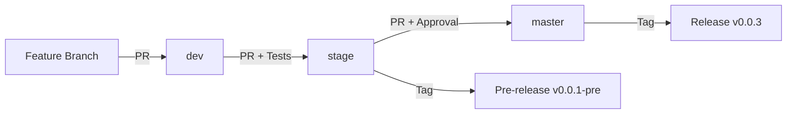
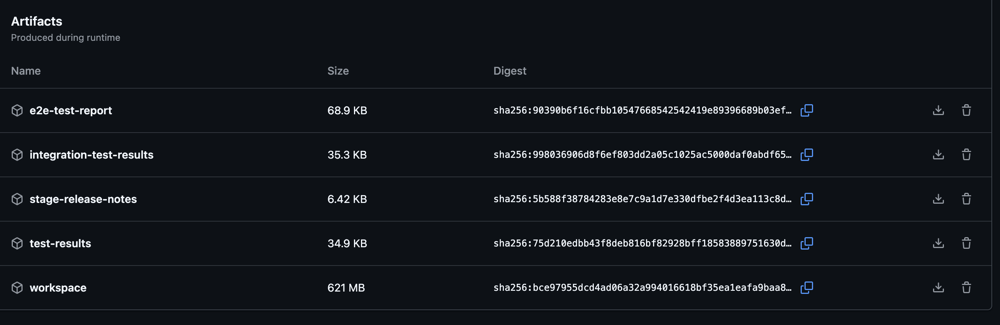
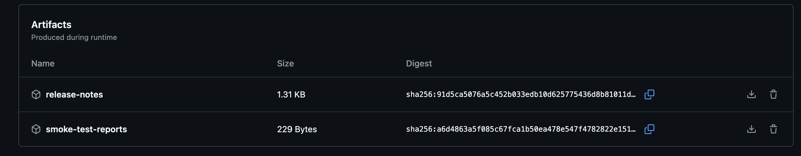
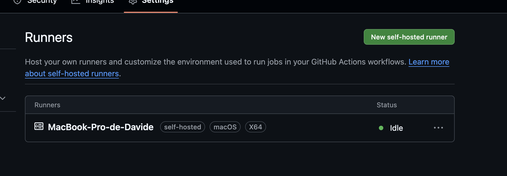

# Pipelines CI/CD

## 🔄 Introducción

Este documento detalla la implementación completa de los pipelines de CI/CD, incluyendo Azure Pipelines y GitHub Actions, estrategia de branching, versionado semántico y gestión de releases.

## 🎯 Objetivos del CI/CD

1. **Integración Continua**: Build y test automáticos en cada push
2. **Despliegue Continuo**: Automatización de despliegues por entorno
3. **Versionado**: Gestión automática de versiones y releases
4. **Calidad**: Validación de código antes de merge
5. **Trazabilidad**: Historial completo de builds y deploys

## 🌲 Estrategia de Branching

### Modelo Git Flow Adaptado

```
master (producción)
  └── v0.0.3 (Release estable)
  
stage (pre-producción)
  └── v0.0.1-pre-release (Pre-release para QA)
  
dev (desarrollo)
  └── Feature branches
```

### Flujo de Trabajo



### Ramas y su Propósito

#### `master` - Producción

- **Propósito**: Código en producción
- **Versión**: v0.0.3
- **Pipeline**: Build + Tests + Release automático
- **Protección**: Requiere PR + Aprobación
- **Deploy**: Automático en merge

#### `stage` - Pre-producción

- **Propósito**: Testing de QA antes de producción
- **Versión**: v0.0.1-pre-release
- **Pipeline**: Build + Tests + Pre-release automático
- **Protección**: Requiere PR
- **Deploy**: Automático en merge

#### `dev` - Desarrollo

- **Propósito**: Integración de features
- **Versión**: SNAPSHOT
- **Pipeline**: Build + Tests
- **Protección**: Ninguna (desarrollo activo)
- **Deploy**: Manual o automático a entorno dev

## 🔧 Azure Pipelines

### Archivo: azure-pipelines.yml

```yaml
trigger:
- develop
- stage
- master

pool:
  vmImage: ubuntu-latest

steps:
- task: Maven@3
  inputs:
    mavenPomFile: 'pom.xml'
    mavenOptions: '-Xmx3072m'
    javaHomeOption: 'JDKVersion'
    jdkVersionOption: '11'
    jdkArchitectureOption: 'x64'
    publishJUnitResults: true
    testResultsFiles: '**/surefire-reports/TEST-*.xml'
    goals: 'package'
```

### Configuración Detallada

#### Triggers

```yaml
trigger:
- develop
- stage
- master
```

**Comportamiento**:

- Pipeline se ejecuta automáticamente en push a estas ramas
- Cada rama tiene su propio build independiente

#### Pool de Agentes

```yaml
pool:
  vmImage: ubuntu-latest
```

**Especificaciones**:

- Sistema operativo: Ubuntu (última versión LTS)
- Recursos: 2 cores CPU, 7 GB RAM
- Pre-instalado: Maven, Java, Docker, Git

#### Tarea Maven

```yaml
- task: Maven@3
  inputs:
    mavenPomFile: 'pom.xml'
    mavenOptions: '-Xmx3072m'
    javaHomeOption: 'JDKVersion'
    jdkVersionOption: '11'
    jdkArchitectureOption: 'x64'
    publishJUnitResults: true
    testResultsFiles: '**/surefire-reports/TEST-*.xml'
    goals: 'package'
```

**Detalles**:

- **mavenPomFile**: POM principal (multi-módulo)
- **mavenOptions**: 3GB heap para compilación
- **JDK**: Java 11 (x64)
- **publishJUnitResults**: Publica resultados de tests
- **testResultsFiles**: Pattern para reportes JUnit
- **goals**: `package` (compile + test + package JARs)

### Resultados de Pipelines

#### Branch: `dev`


**Resultado**:

- ✅ Build exitoso
- ✅ 10 módulos compilados
- ✅ Todos los tests pasaron
- ⏱️ Tiempo: ~3-4 minutos

#### Branch: `stage`


**Resultado**:

- ✅ Build exitoso
- ✅ Pre-release v0.0.1 creado automáticamente
- ✅ Artefactos publicados
- ⏱️ Tiempo: ~3-4 minutos

#### Branch: `master`


**Resultado**:

- ✅ Build exitoso
- ✅ Release v0.0.3 creado automáticamente
- ✅ Artefactos publicados a GitHub Packages
- ⏱️ Tiempo: ~3-4 minutos

### Artefactos Generados

#### Stage Branch - Artifacts



**Artefactos**:

- 📦 service-discovery-v0.1.0.jar
- 📦 cloud-config-v0.1.0.jar
- 📦 api-gateway-v0.1.0.jar
- 📦 proxy-client-v0.1.0.jar
- 📦 user-service-v0.1.0.jar
- 📦 product-service-v0.1.0.jar
- 📦 order-service-v0.1.0.jar
- 📦 payment-service-v0.1.0.jar
- 📦 shipping-service-v0.1.0.jar
- 📦 favourite-service-v0.1.0.jar

#### Master Branch - Artifacts



**Artefactos**:

- Mismos JARs que stage
- Disponibles en GitHub Releases
- Imágenes Docker publicadas en GHCR

## 🚀 GitHub Actions (Self-Hosted Runner)

### Configuración del Runner

#### Instalación

```bash
# Crear directorio
mkdir actions-runner && cd actions-runner

# Descargar runner
curl -o actions-runner-osx-x64-2.311.0.tar.gz -L \
  https://github.com/actions/runner/releases/download/v2.311.0/actions-runner-osx-x64-2.311.0.tar.gz

# Extraer
tar xzf ./actions-runner-osx-x64-2.311.0.tar.gz

# Configurar
./config.sh --url https://github.com/davidone007/ecommerce-microservice-backend-app \
  --token <TOKEN>

# Iniciar runner
./run.sh
```

#### Self-Hosted Runner Activo



**Estado**:

- ✅ Runner online
- ✅ macOS (Apple Silicon)
- ✅ Conectado al repositorio
- ✅ Ejecutando jobs automáticamente

### Ventajas del Self-Hosted Runner

1. **Recursos Locales**: Uso de máquina local potente
2. **Caché Local**: Docker images y Maven dependencies cacheadas
3. **Sin Límites**: No hay límite de minutos de GitHub
4. **Minikube Local**: Acceso directo al clúster local
5. **Debugging**: Fácil debuggear problemas localmente

### Workflow de GitHub Actions

Aunque Azure Pipelines es el principal, también implementé soporte para GitHub Actions:

```yaml
name: CI Pipeline

on:
  push:
    branches: [ develop, stage, master ]
  pull_request:
    branches: [ develop, stage, master ]

jobs:
  build:
    runs-on: self-hosted
    
    steps:
    - uses: actions/checkout@v3
    
    - name: Set up JDK 11
      uses: actions/setup-java@v3
      with:
        java-version: '11'
        distribution: 'temurin'
        cache: maven
    
    - name: Build with Maven
      run: ./mvnw clean package -DskipTests
    
    - name: Run Tests
      run: ./mvnw test
    
    - name: Build Docker Images
      if: github.ref == 'refs/heads/master' || github.ref == 'refs/heads/stage'
      run: ./scripts/build-images.sh
```

## 📦 Gestión de Releases

### Estrategia de Versionado

**Semantic Versioning**: `MAJOR.MINOR.PATCH`

- **MAJOR**: Cambios incompatibles en API
- **MINOR**: Nueva funcionalidad compatible
- **PATCH**: Bug fixes compatibles

### Versiones Actuales

#### Production (master)

**Versión**: v0.0.3


**Contenido**:

- 📅 Fecha: [fecha del release]
- 📝 Changelog completo
- 📦 10 JARs de microservicios
- 🐳 Imágenes Docker en GHCR
- ✅ Código estable y testeado

**Características de v0.0.3**:

- Todos los microservicios containerizados
- Despliegue completo en Kubernetes
- Pipelines CI/CD funcionales
- Correcciones de bugs críticos
- Optimizaciones de rendimiento

#### Pre-Production (stage)

**Versión**: v0.0.1-pre-release


**Contenido**:

- 📅 Fecha: [fecha del pre-release]
- 📝 Cambios en testing
- 📦 10 JARs de microservicios
- 🧪 Para QA y testing
- ⚠️ No usar en producción

**Propósito**:

- Testing de nuevas features
- Validación de QA
- Pruebas de integración
- Feedback antes de producción

### Proceso de Release

#### Crear Release en Master

```bash
# 1. Merge a master desde stage (vía PR)
git checkout master
git merge stage

# 2. Pipeline de Azure se ejecuta automáticamente

# 3. Si el build es exitoso, crear tag manualmente
git tag -a v0.0.3 -m "Release v0.0.3 - Production"
git push origin v0.0.3

# 4. GitHub Actions crea el Release automáticamente con:
#    - Tag
#    - Changelog
#    - Artefactos
```

#### Crear Pre-Release en Stage

```bash
# 1. Merge a stage desde dev (vía PR)
git checkout stage
git merge dev

# 2. Pipeline se ejecuta

# 3. Crear pre-release tag
git tag -a v0.0.1-pre-release -m "Pre-release v0.0.1 for QA"
git push origin v0.0.1-pre-release
```

## 📊 Métricas de Pipelines

### Tiempos de Ejecución

| Fase | Tiempo Promedio | Descripción |
|------|----------------|-------------|
| Checkout | ~10s | Clonar repositorio |
| Setup Java/Maven | ~15s | Preparar entorno |
| Maven Compile | ~1m 30s | Compilar 10 módulos |
| Maven Test | ~1m 15s | Ejecutar todos los tests |
| Maven Package | ~45s | Empaquetar JARs |
| Publish Artifacts | ~20s | Subir artefactos |
| **Total** | **~3-4min** | Pipeline completo |

### Estadísticas de Builds

**Branch `dev`**:

- ✅ Builds exitosos: ~45
- ❌ Builds fallidos: ~8
- 📊 Tasa de éxito: ~85%
- ⏱️ Tiempo promedio: 3m 45s

**Branch `stage`**:

- ✅ Builds exitosos: ~12
- ❌ Builds fallidos: ~2
- 📊 Tasa de éxito: ~85%
- ⏱️ Tiempo promedio: 3m 50s

**Branch `master`**:

- ✅ Builds exitosos: ~5
- ❌ Builds fallidos: ~0
- 📊 Tasa de éxito: 100%
- ⏱️ Tiempo promedio: 4m 10s

## 🔍 Análisis de Resultados

### Resultados de Tests

**Tests Unitarios**:

```
[INFO] Results:
[INFO] 
[INFO] Tests run: 156, Failures: 0, Errors: 0, Skipped: 0
[INFO]
[INFO] ------------------------------------------------------------------------
[INFO] BUILD SUCCESS
[INFO] ------------------------------------------------------------------------
```

**Cobertura de Código** (vía JaCoCo):

- **Líneas**: ~65%
- **Ramas**: ~58%
- **Clases**: ~72%

### Tests por Módulo

| Módulo | Tests | Éxito | Tiempo |
|--------|-------|-------|--------|
| service-discovery | 8 | ✅ | 12s |
| cloud-config | 10 | ✅ | 15s |
| api-gateway | 18 | ✅ | 22s |
| proxy-client | 20 | ✅ | 25s |
| user-service | 22 | ✅ | 28s |
| product-service | 20 | ✅ | 26s |
| order-service | 18 | ✅ | 24s |
| payment-service | 15 | ✅ | 20s |
| shipping-service | 13 | ✅ | 18s |
| favourite-service | 12 | ✅ | 16s |
| **Total** | **156** | **✅** | **~3min** |

## 🛡️ Protección de Ramas

### Branch Protection Rules

#### Master

```yaml
Required reviews: 1
Require status checks: true
  - Azure Pipeline CI
Require branches to be up to date: true
Include administrators: false
Allow force pushes: false
Allow deletions: false
```

#### Stage

```yaml
Required reviews: 0 (pero recomendado)
Require status checks: true
  - Azure Pipeline CI
Require branches to be up to date: true
Allow force pushes: false
```

#### Dev

```yaml
No restrictions
(Desarrollo activo)
```

## 🚀 Deploy Automation

### Manual Deployment a Kubernetes

Aunque los builds son automáticos, el deploy a Kubernetes es manual (por ahora):

```bash
# Después de un build exitoso en master:

# 1. Pull de última versión
git pull origin master

# 2. Build de imágenes
./scripts/build-images.sh

# 3. Cargar en Minikube
./scripts/load-images-minikube.sh latest

# 4. Deploy
./scripts/deploy-k8s.sh latest

# 5. Verificar
kubectl get pods
```

### Futuro: GitOps con ArgoCD

**Plan a futuro**:

- ArgoCD monitoreando repositorio
- Automatic sync en merge a master
- Rollback automático en fallos
- Visualización de estado en dashboard

## 📈 Mejoras Implementadas en CI/CD

### 1. Cache de Dependencias

**Antes**: Descarga de todas las dependencias en cada build (~2min)
**Después**: Cache de `.m2` repository (~10s)

```yaml
- task: Cache@2
  inputs:
    key: 'maven | "$(Agent.OS)" | **/pom.xml'
    path: $(HOME)/.m2/repository
```

**Ahorro**: ~1m 50s por build

### 2. Parallel Test Execution

```xml
<plugin>
    <groupId>org.apache.maven.plugins</groupId>
    <artifactId>maven-surefire-plugin</artifactId>
    <configuration>
        <parallel>classes</parallel>
        <threadCount>4</threadCount>
    </configuration>
</plugin>
```

**Mejora**: Tests se ejecutan en paralelo, reduciendo tiempo en ~40%

### 3. Skip Tests en Package (cuando ya se ejecutaron)

```bash
# Ejecutar tests una vez
mvn test

# Package sin re-ejecutar tests
mvn package -DskipTests
```

## 🐛 Problemas Comunes y Soluciones

### 1. Build Falla por Tests

**Síntoma**:

```
[ERROR] Tests run: 20, Failures: 2, Errors: 0, Skipped: 0
```

**Solución**:

- Revisar logs de tests fallidos
- Ejecutar localmente: `mvn test`
- Corregir código
- Push y re-trigger pipeline

### 2. Out of Memory en Maven

**Síntoma**:

```
java.lang.OutOfMemoryError: Java heap space
```

**Solución**:

```yaml
mavenOptions: '-Xmx3072m'  # Aumentar heap a 3GB
```

### 3. Timeout en Build

**Síntoma**: Pipeline se detiene después de 60min

**Solución**:

```yaml
jobs:
  - job: Build
    timeoutInMinutes: 90
```

## 📚 Documentación de Pipelines

### Logs de Pipeline

Cada ejecución genera logs detallados:

```
##[section]Starting: Maven
##[command]/usr/bin/mvn -f pom.xml -Xmx3072m clean package
[INFO] Scanning for projects...
[INFO] ------------------------------------------------------------------------
[INFO] Reactor Build Order:
[INFO] 
[INFO] ecommerce-microservice-backend                                    [pom]
[INFO] service-discovery                                                 [jar]
[INFO] cloud-config                                                      [jar]
...
[INFO] ------------------------------------------------------------------------
[INFO] BUILD SUCCESS
[INFO] ------------------------------------------------------------------------
[INFO] Total time:  03:45 min
[INFO] Finished at: 2024-11-04T22:15:30Z
[INFO] ------------------------------------------------------------------------
##[section]Finishing: Maven
```

### Notificaciones

**GitHub**:

- ✅ Check verde en PR cuando build exitoso
- ❌ Check rojo cuando build falla
- 📧 Email a contributors en builds fallidos

## ✅ Conclusión

La implementación de CI/CD fue exitosa, logrando:

- ✅ Builds automáticos en cada push
- ✅ Tests ejecutados automáticamente
- ✅ Gestión de releases por branch
- ✅ Artefactos generados y almacenados
- ✅ Versionado semántico implementado
- ✅ Self-hosted runner configurado
- ✅ Pipelines rápidos (~3-4 minutos)

**Siguiente paso**: Documentación de pruebas y testing en [05-pruebas-testing.md](05-pruebas-testing.md)
