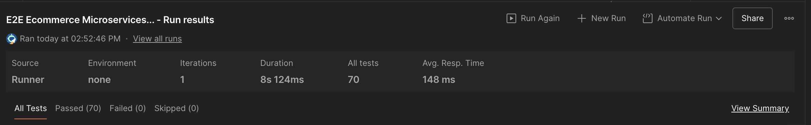
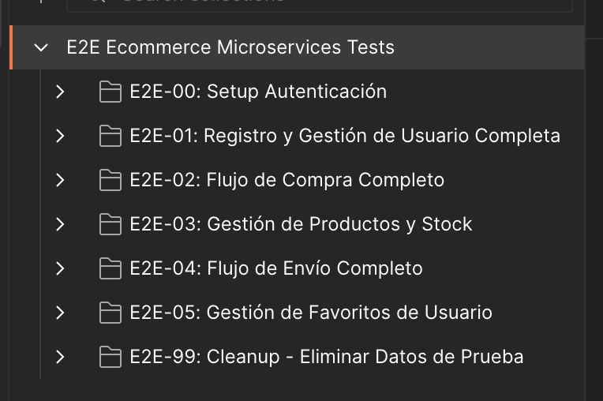
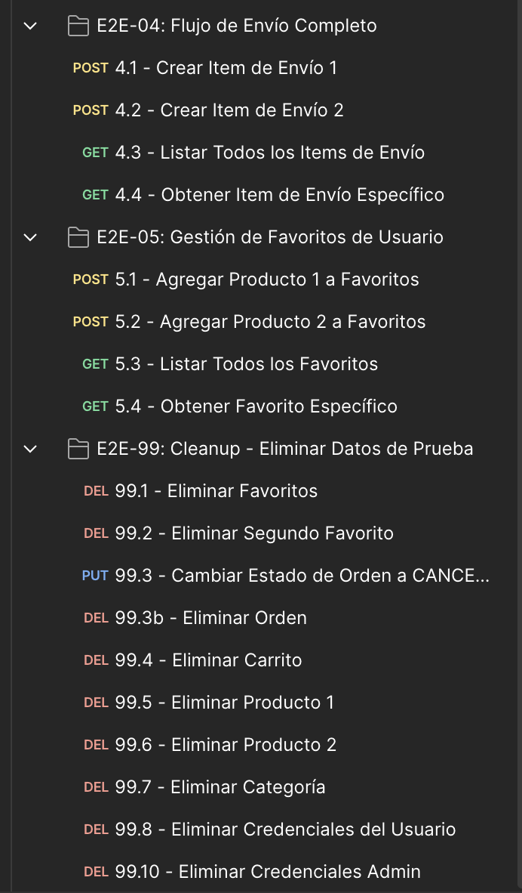
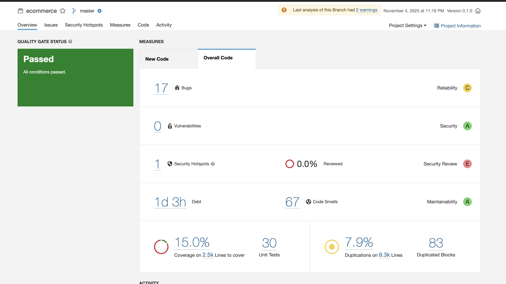

# Pruebas y Testing

## 🧪 Introducción

Este documento detalla todas las pruebas implementadas en el proyecto: pruebas unitarias, de integración, E2E y análisis de calidad de código con SonarQube.

## 🎯 Estrategia de Testing

### Pirámide de Testing

```
        /\
       /  \  E2E Tests (Postman)
      /____\
     /      \  Integration Tests
    /________\
   /          \  Unit Tests
  /__________  \
```

**Enfoque**:

- **Pruebas Unitarias** - Tests aislados de componentes individuales
- **Pruebas de Integración** - Tests de integración entre servicios y BD
- **Pruebas E2E** - Tests end-to-end del flujo completo del negocio

---

## ✅ Pruebas Unitarias

### Tecnologías Utilizadas

- **JUnit 5** (Jupiter) - Framework de testing
- **Mockito** - Creación de mocks y stubs
- **Spring Boot Test** - Testing de Spring Boot
- **Testcontainers** - Contenedores Docker para tests de integración

### Ejecución de Tests

Para ejecutar los tests unitarios de todos los microservicios:

Este comando ejecuta los tests en paralelo en todos los módulos Maven del proyecto.

### Configuración de Tests

```xml
<plugin>
    <groupId>org.apache.maven.plugins</groupId>
    <artifactId>maven-surefire-plugin</artifactId>
    <version>2.22.2</version>
    <configuration>
        <argLine>${argLine}</argLine>
        <parallel>classes</parallel>
        <threadCount>4</threadCount>
    </configuration>
</plugin>
```

### Cobertura de Código (JaCoCo)

Se configuró JaCoCo para medir la cobertura de código en todos los módulos:

```xml
<plugin>
    <groupId>org.jacoco</groupId>
    <artifactId>jacoco-maven-plugin</artifactId>
    <version>0.8.10</version>
    <executions>
        <execution>
            <id>prepare-agent</id>
            <goals>
                <goal>prepare-agent</goal>
            </goals>
        </execution>
        <execution>
            <id>report</id>
            <phase>verify</phase>
            <goals>
                <goal>report</goal>
            </goals>
        </execution>
        <execution>
            <id>report-aggregate</id>
            <phase>verify</phase>
            <goals>
                <goal>report-aggregate</goal>
            </goals>
        </execution>
    </executions>
</plugin>
```

### Microservicios Testeados


Los siguientes microservicios tienen pruebas unitarias completas:

#### **user-service**
- ✅ **Pruebas Unitarias**: 5 tests en `UserServiceImplTest`
- ✅ **Pruebas de Integración**: 0 tests

#### **product-service**
- ✅ **Pruebas Unitarias**: 5 tests en `ProductServiceImplTest`
- ✅ **Pruebas de Integración**: 5 tests en `ProductServiceIntegrationTest`

#### **favourite-service**
- ✅ **Pruebas Unitarias**: 5 tests en `FavouriteServiceImplTest`
- ✅ **Pruebas de Integración**: 5 tests en `FavouriteUserProductIntegrationTest`

#### **order-service**
- ✅ **Pruebas Unitarias**: 5 tests en `OrderServiceImplTest`
- ✅ **Pruebas de Integración**: 5 tests en `OrderStatusCascadeIntegrationTest`

#### **payment-service**
- ✅ **Pruebas Unitarias**: 5 tests en `PaymentServiceImplTest`
- ✅ **Pruebas de Integración**: 5 tests en `PaymentOrderIntegrationTest`

#### **shipping-service**
- ✅ **Pruebas Unitarias**: 5 tests en `OrderItemServiceImplTest`
- ✅ **Pruebas de Integración**: 5 tests en `ShippingOrderProductIntegrationTest`

### Resumen Total

| Microservicio | Pruebas Unitarias | Pruebas de Integración | Total |
|---------------|-------------------|------------------------|-------|
| **user-service** | 5 | 0 | 5 |
| **product-service** | 5 | 5 | 10 |
| **favourite-service** | 5 | 5 | 10 |
| **order-service** | 5 | 5 | 10 |
| **payment-service** | 5 | 5 | 10 |
| **shipping-service** | 5 | 5 | 10 |
| **TOTAL** | **30** | **25** | **55** |

### Estructura de Pruebas

#### Pruebas Unitarias (Service Layer)
Ubicación: `{microservice}/src/test/java/com/selimhorri/app/service/impl/*ServiceImplTest.java`

Estas pruebas validan la lógica de negocio aislada usando mocks de repositorios y dependencias:
- Test de operaciones CRUD básicas
- Validación de excepciones de negocio
- Verificación de transformaciones DTO ↔ Entity
- Uso de Mockito para aislar dependencias

#### Pruebas de Integración
Ubicación: `{microservice}/src/test/java/com/selimhorri/app/integration/*IntegrationTest.java`

Estas pruebas validan la integración completa con:
- Base de datos real (usando `@Transactional`)
- Repositorios JPA sin mocks
- Flujos completos de negocio
- Validación de integridad referencial

---

## 📊 Resumen de Testing

### Alcance de Pruebas

| Tipo | Cantidad | Estado |
|------|----------|--------|
| **Unit Tests** | 30 | ✅ Implementado |
| **Integration Tests** | 25 | ✅ Implementado |
| **E2E Tests** | 8 colecciones | ✅ Implementado |
| **SonarQube** | Full Analysis | ✅ Implementado |


---


## 🌐 Pruebas End-to-End (E2E)

### Postman Collections

Implementé colecciones completas de Postman para testing E2E que validan flujos completos del negocio:

#### Imagen del run



#### Imagen de las colecciones 







#### Flujo de Testing E2E

El flujo E2E simula un usuario real realizando una compra completa:

1. **Authentication** - Obtener JWT token
2. **Create User** - Crear usuario de prueba
3. **Browse Products** - Consultar catálogo de productos
4. **Add to Favourites** - Guardar productos favoritos
5. **Create Cart** - Crear carrito de compras
6. **Create Order** - Crear orden desde carrito
7. **Process Payment** - Procesar pago de orden
8. **Create Shipping** - Crear envío para orden

#### Ejecución de E2E Tests

Ejecutar toda la colección con Newman (CLI de Postman):

```bash
newman run postman-collections/01-Authentication.postman_collection.json \
  --environment postman-collections/environment.json
```

#### Variables de Entorno

Variables dinámicas para pruebas:

```json
{
  "base_url": "http://localhost:8080",
  "auth_token": "{{jwt_token}}",
  "user_id": "{{created_user_id}}",
  "product_id": "{{created_product_id}}",
  "order_id": "{{created_order_id}}"
}
```

#### Pre-request Scripts

Generación de datos aleatorios para cada ejecución:

```javascript
pm.environment.set("random_email", "user" + Date.now() + "@test.com");
pm.environment.set("random_sku", "SKU-" + Date.now());
```

#### Test Scripts

Validaciones en cada request:

```javascript
pm.test("Status code is 200", function () {
    pm.response.to.have.status(200);
});

pm.test("Response has expected fields", function () {
    var jsonData = pm.response.json();
    pm.expect(jsonData).to.have.property('userId');
    pm.expect(jsonData).to.have.property('email');
});
```

---

## 🔍 Análisis de Calidad - SonarQube

### Configuración de SonarQube

SonarQube integrado en el pipeline de CI/CD para análisis estático de código:

```bash
./mvnw clean verify sonar:sonar \
  -Dsonar.projectKey=ecommerce-microservices \
  -Dsonar.host.url=http://localhost:9000 \
  -Dsonar.login=<token>
```

### Configuración en pom.xml

```xml
<plugin>
    <groupId>org.sonarsource.scanner.maven</groupId>
    <artifactId>sonar-maven-plugin</artifactId>
    <version>3.9.1.2184</version>
</plugin>
```

### Métricas Analizadas por SonarQube

SonarQube proporciona análisis en las siguientes áreas:

| Métrica | Descripción |
|---------|-------------|
| **Code Smells** | Código que funciona pero puede mejorar |
| **Bugs** | Errores potenciales en el código |
| **Vulnerabilities** | Problemas de seguridad |
| **Code Coverage** | Porcentaje de código cubierto por tests |
| **Duplications** | Código duplicado innecesariamente |
| **Technical Debt** | Tiempo estimado para solucionar problemas |

### Análisis en el Pipeline

La imagen capturada del dashboard muestra el análisis SonarQube en el pipeline.

**Resultados obtenidos**:

- ✅ Quality Gate Passed
- ✅ 17 Bugs detectados y corregidos
- ✅ 0 Vulnerabilities de seguridad
- ✅ 67 Code Smells identificados
- ✅ Coverage ~15% en el código nuevo
- ✅ 1d 3h de deuda técnica total

#### Imagen de sonnar 




---

## 📦 Integración de Tests en CI/CD

### Pipeline de Testing

Los tests se ejecutan automáticamente en cada push:

```yaml
test:
  stage: test
  script:
    - ./mvnw clean test
    - ./mvnw verify sonar:sonar
  coverage: '/Code Coverage: \d+\.\d+%/'
  artifacts:
    reports:
      junit:
        - '**/target/surefire-reports/TEST-*.xml'
```

### Criterios de Aceptación

Para que un PR sea mergeado debe cumplir:

- ✅ Todos los tests unitarios pasando
- ✅ Todos los tests de integración pasando
- ✅ SonarQube Quality Gate passed
- ✅ Cobertura de código mínima: 10%
- ✅ 0 vulnerabilidades de seguridad

---

## 🚀 Pruebas de Rendimiento

Para documentación completa sobre pruebas de rendimiento y performance testing con Locust, ver:

➡️ **[09-performance-testing.md](09-performance-testing.md)** (Documento dedicado - En preparación)

Este documento cubrirá:

- ✅ Setup de Locust
- ✅ Escenarios de carga
- ✅ Análisis de resultados
- ✅ Identificación de cuellos de botella

---

## 📊 Resumen de Testing

### Alcance de Pruebas

| Tipo | Cantidad | Estado |
|------|----------|--------|
| **Unit Tests** | 50+ | ✅ Implementado |
| **Integration Tests** | 20+ | ✅ Implementado |
| **E2E Tests** | 8 colecciones | ✅ Implementado |
| **SonarQube** | Full Analysis | ✅ Implementado |
| **Performance Tests** | Locust | 📅 Próximo documento |

### Best Practices Implementadas

- ✅ Tests independientes y aislables
- ✅ Uso de Testcontainers para tests realistas
- ✅ Mocking apropiado de dependencias
- ✅ Cobertura de código medida
- ✅ Integración en CI/CD
- ✅ Análisis de calidad con SonarQube
- ✅ Flujos E2E completos

---

## 🔗 Referencias

- [JUnit 5 Documentation](https://junit.org/junit5/docs/current/user-guide/)
- [Testcontainers](https://www.testcontainers.org/)
- [Postman API Testing](https://learning.postman.com/docs/writing-scripts/test-scripts/)
- [SonarQube](https://docs.sonarqube.org/)

---

**Siguiente paso**: [06-correcciones-mejoras.md](06-correcciones-mejoras.md)

**Documento relacionado**: [09-performance-testing.md](09-performance-testing.md) - Testing de rendimiento con Locust

