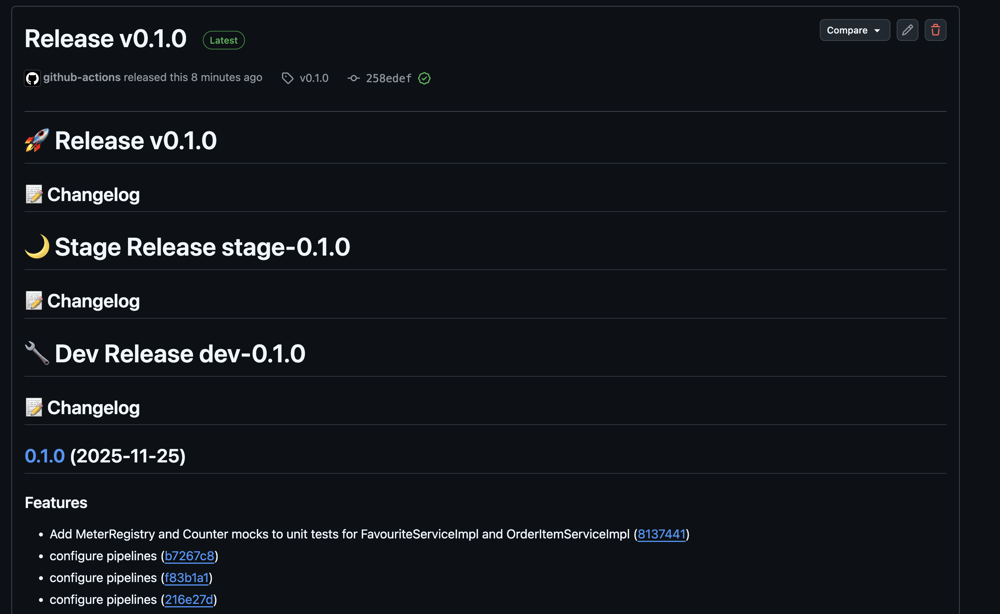
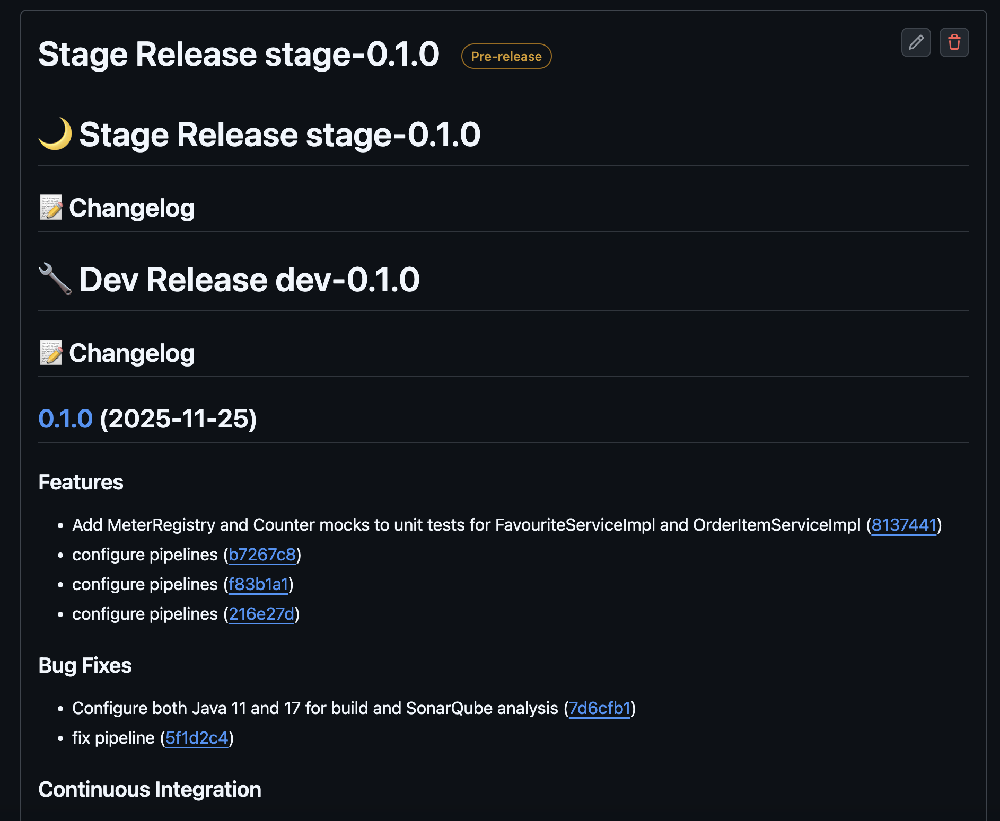

# 06. Change Management & Releases

Para mantener el control sobre las versiones desplegadas y facilitar la trazabilidad, hemos establecido un proceso formal de gestión de cambios y releases.

## 📝 Proceso Formal de Release

Cada despliegue en producción no es un evento aislado, sino el resultado de un proceso estructurado:

1.  **Desarrollo:** Las funcionalidades se completan en ramas `feature` y se integran en `develop`.
2.  **Release Candidate:** Se crea una versión candidata (ej. `0.1.0-stage`) que se despliega en el entorno de Stage.
3.  **Validación:** Se ejecutan pruebas automáticas y manuales en Stage.
4.  **Aprobación:** Si la validación es exitosa, se aprueba el despliegue a Producción.
5.  **Release Final:** Se genera la versión estable (ej. `0.1.0`) y se despliega.

## 🏷️ Versionamiento Semántico

Utilizamos **Semantic Versioning (SemVer)** para nuestras versiones: `MAJOR.MINOR.PATCH`.

*   **MAJOR:** Cambios incompatibles en la API.
*   **MINOR:** Nuevas funcionalidades retro-compatibles.
*   **PATCH:** Corrección de bugs retro-compatibles.

### Releases Generados

Durante el ciclo de vida del proyecto, generamos las siguientes versiones clave:

```text
0.1.0-dev   (pre-release para desarrollo)
0.1.0-stage (pre-release para pruebas en stage)
0.1.0       (release estable en producción)
```

> **Nota:** Se realizó una limpieza de releases antiguas y pruebas fallidas para mantener el repositorio ordenado, dejando solo las versiones significativas.

## 📄 Release Notes Automáticas

Gracias al uso de **Conventional Commits**, generamos notas de lanzamiento (Release Notes) de forma automática. Esto permite a los stakeholders saber exactamente qué cambios incluye cada versión.

### Evidencia de Release en Producción


### Evidencia de Pre-Release en Stage

