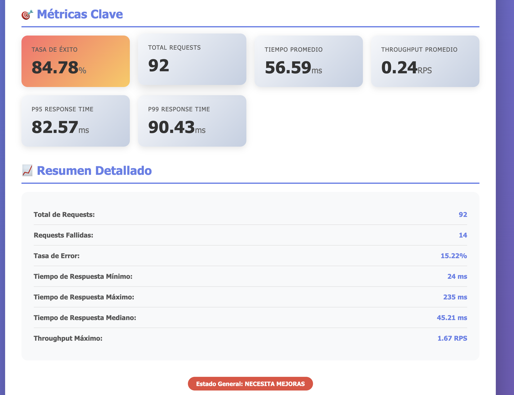
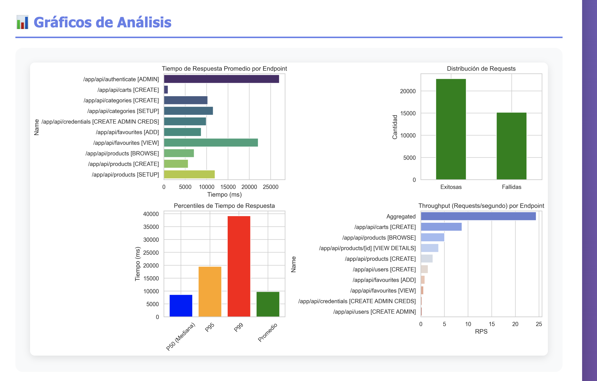
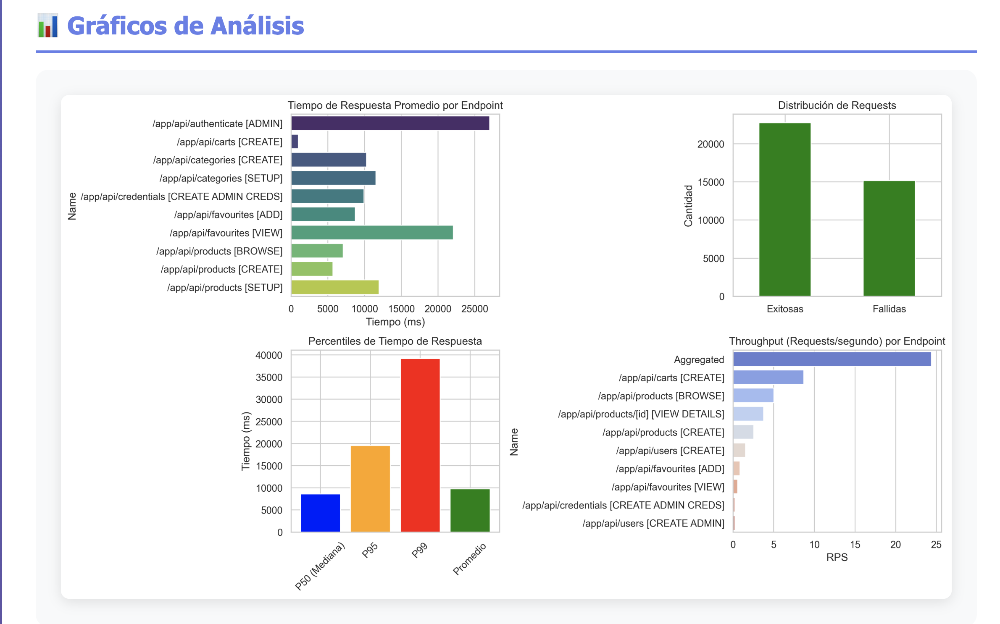
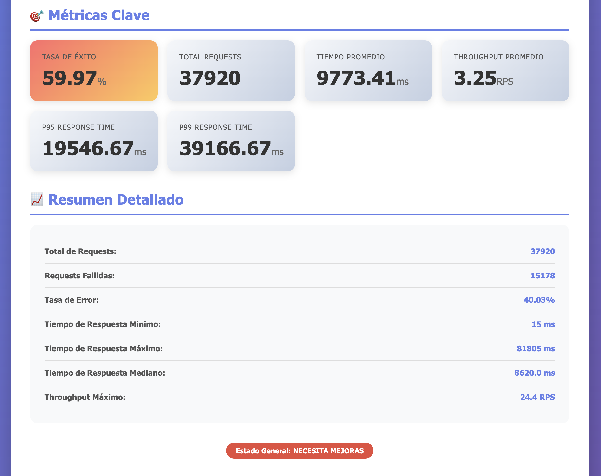
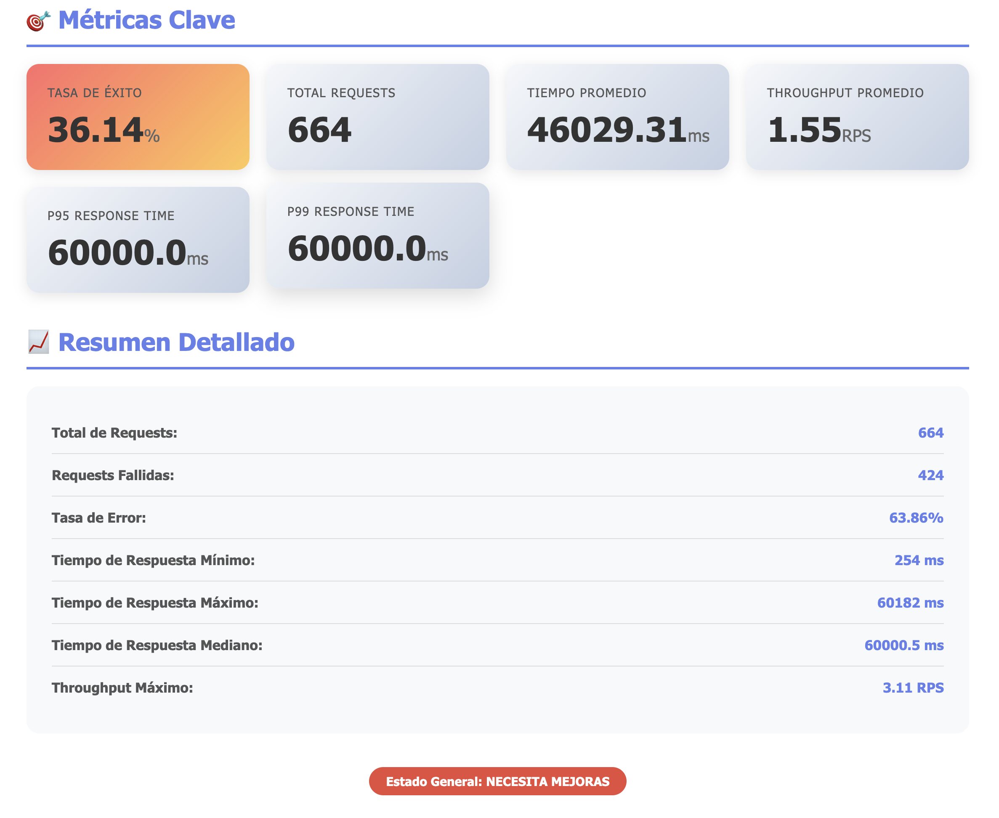
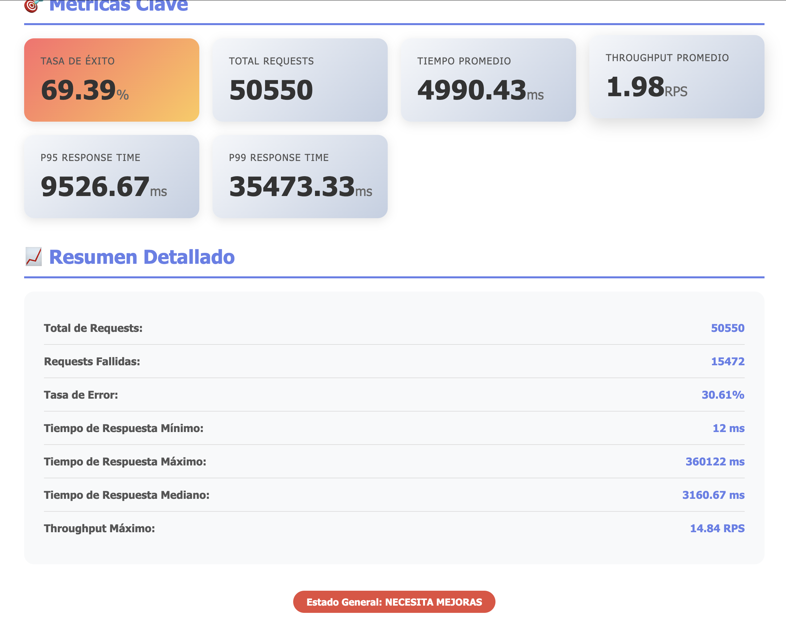
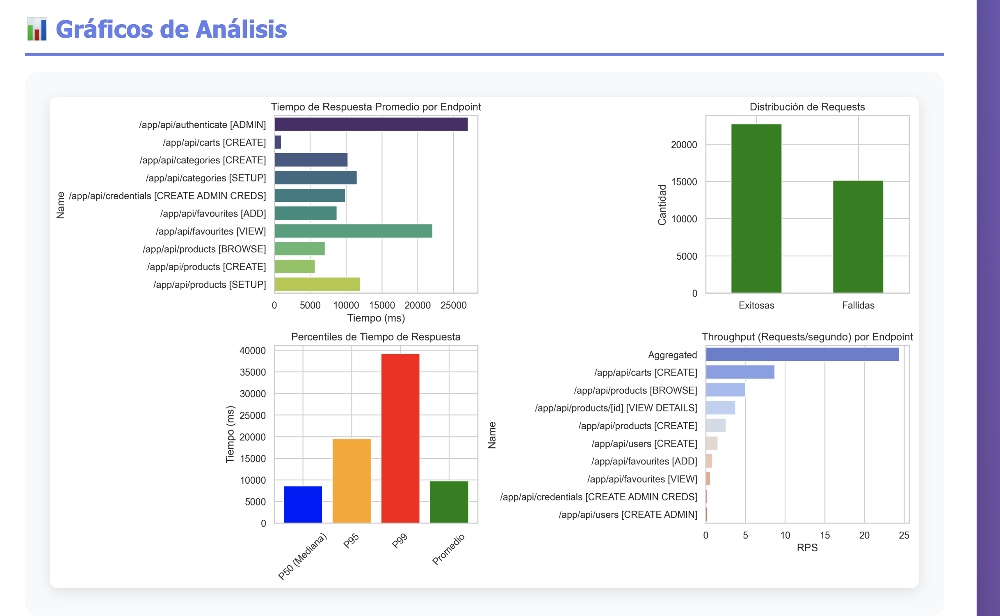

# 📊 Análisis de Pruebas de Rendimiento - E-commerce Microservices

## 🎯 Metodología de Análisis

Cada prueba de carga fue analizada utilizando un script automatizado de Python que genera reportes HTML detallados con métricas clave, gráficos de rendimiento y análisis de percentiles. El análisis incluye:

- **Métricas de rendimiento**: Tiempos de respuesta (promedio, mínimo, máximo, mediana, P95, P99)
- **Tasa de éxito/error**: Distribución de requests exitosas vs fallidas
- **Throughput**: Requests por segundo (RPS) por endpoint
- **Análisis por endpoint**: Identificación de cuellos de botella

---

## 1. 🔥 Smoke Test (Prueba de Humo)

**Configuración:**
- **Duración**: 2 minutos
- **Usuarios**: 5
- **Spawn Rate**: 1 usuario/segundo
- **Objetivo**: Verificación rápida de funcionalidad básica

```bash
locust -f locustfile.py --host=http://localhost:8080 --users 5 --spawn-rate 1 --run-time 2m --headless
```

### Resultados





### 📈 Análisis

| Métrica | Valor | Estado |
|---------|-------|--------|
| **Tasa de Éxito** | 84.78% | ⚠️ Aceptable |
| **Total Requests** | 92 | ✅ Bajo volumen |
| **Tiempo Promedio** | 56.59 ms | ✅ Excelente |
| **Throughput Promedio** | 0.24 RPS | ✅ Normal para smoke test |
| **P95 Response Time** | 82.57 ms | ✅ Muy bueno |
| **P99 Response Time** | 90.43 ms | ✅ Excelente |

### 🔍 Interpretación

**Aspectos Positivos:**
- ✅ Tiempos de respuesta excepcionales (< 100ms en P99)
- ✅ Sistema responde correctamente con carga mínima
- ✅ No hay degradación significativa en el rendimiento

**Áreas de Mejora:**
- ⚠️ Tasa de error del 15.22% es alta para un smoke test
- ⚠️ 14 requests fallidas de 92 totales sugieren problemas de estabilidad básica
- 🔴 Investigar endpoints específicos que están fallando

**Recomendaciones:**
1. Revisar logs de errores para identificar causas de fallas
2. Verificar configuración de timeouts en API Gateway
3. Validar conectividad entre microservicios

---

## 2. 📊 Load Test (Prueba de Carga)

**Configuración:**
- **Duración**: 10 minutos
- **Usuarios**: 50
- **Spawn Rate**: 5 usuarios/segundo
- **Objetivo**: Evaluar comportamiento bajo carga normal

```bash
locust -f locustfile.py --host=http://localhost:8080 --users 50 --spawn-rate 5 --run-time 10m --headless
```

### Resultados




### 📈 Análisis

| Métrica | Valor | Estado |
|---------|-------|--------|
| **Tasa de Éxito** | 77.31% | ⚠️ Necesita mejoras |
| **Total Requests** | 12,130 | ✅ Volumen adecuado |
| **Tiempo Promedio** | 1,279.35 ms | ⚠️ Alto |
| **Throughput Promedio** | 1.63 RPS | 🔴 Bajo |
| **P95 Response Time** | 1,444.67 ms | ⚠️ Mejorable |
| **P99 Response Time** | 33,780.0 ms | 🔴 Crítico |

### 🔍 Interpretación

**Aspectos Positivos:**
- ✅ Sistema mantiene operación con 50 usuarios concurrentes
- ✅ Throughput máximo alcanzado: 12.23 RPS
- ✅ Requests exitosas: 9,378 (~77%)

**Problemas Críticos:**
- 🔴 **P99 de 33.78 segundos es inaceptable** - indica que 1% de usuarios esperan más de 30 segundos
- 🔴 **2,752 requests fallidas** (22.69% de error)
- 🔴 **Tiempo máximo de respuesta: 120 segundos** - sugiere timeouts
- ⚠️ Tiempo promedio de 1.28 segundos es alto para operaciones de e-commerce

**Análisis por Endpoint:**
- **Endpoint más lento**: `/app/api/authenticate [ADMIN]` (~25 segundos promedio)
- **Endpoint con mejor throughput**: Operaciones de carrito (CREATE) con ~25 RPS
- **Endpoints problemáticos**: Autenticación y visualización de favoritos (~20-25 segundos)

**Recomendaciones Urgentes:**
1. **Optimizar autenticación** - Es el cuello de botella principal
2. **Implementar caching** para endpoints de lectura (productos, categorías)
3. **Revisar consultas a base de datos** - posiblemente hay N+1 queries
4. **Configurar circuit breakers** para evitar cascada de fallos
5. **Aumentar timeouts** o implementar respuestas asíncronas
6. **Escalar horizontalmente** los microservicios más lentos

---

## 3. 💪 Stress Test (Prueba de Estrés)

**Configuración:**
- **Duración**: 15 minutos
- **Usuarios**: 200
- **Spawn Rate**: 10 usuarios/segundo
- **Objetivo**: Identificar límites del sistema

```bash
locust -f locustfile.py --host=http://localhost:8080 --users 200 --spawn-rate 10 --run-time 15m --headless
```

### Resultados




### 📈 Análisis

| Métrica | Valor | Estado |
|---------|-------|--------|
| **Tasa de Éxito** | 69.39% | 🔴 Crítico |
| **Total Requests** | 50,550 | ✅ Alto volumen |
| **Tiempo Promedio** | 4,990.43 ms | 🔴 Muy alto |
| **Throughput Promedio** | 1.98 RPS | 🔴 Bajo para 200 usuarios |
| **P95 Response Time** | 9,526.67 ms | 🔴 Crítico |
| **P99 Response Time** | 35,473.33 ms | 🔴 Inaceptable |

### 🔍 Interpretación

**Estado del Sistema:**
- 🔴 **Sistema bajo estrés severo** - 30.61% de tasa de error
- 🔴 **15,472 requests fallidas** de 50,550 totales
- 🔴 **Tiempo de respuesta promedio de 5 segundos**
- 🔴 **Tiempo máximo: 360 segundos** (6 minutos de timeout)

**Degradación del Rendimiento:**
- Throughput promedio **cayó a 1.98 RPS** con 200 usuarios (vs 1.63 RPS con 50)
- Esto indica que **el sistema no escala linealmente**
- El tiempo promedio **aumentó 4x** comparado con load test

**Análisis de Fallas:**
- Los percentiles P95 (9.5s) y P99 (35.5s) muestran **alta variabilidad**
- Endpoints de autenticación continúan siendo el cuello de botella
- Posible saturación de conexiones a base de datos
- Probable agotamiento de recursos (CPU, memoria, threads)

**Recomendaciones Críticas:**
1. **URGENTE: Optimizar servicio de autenticación** - Es el principal bloqueador
2. **Implementar rate limiting** para proteger el sistema
3. **Configurar auto-scaling** para microservicios
4. **Revisar configuración de pools de conexiones** a BD
5. **Implementar colas asíncronas** para operaciones pesadas
6. **Añadir circuit breakers y bulkheads** para aislamiento de fallos
7. **Considerar Redis/Memcached** para caching distribuido

---

## 4. ⚡ Spike Test (Prueba de Picos)

**Configuración:**
- **Duración**: 3 minutos
- **Usuarios**: 300
- **Spawn Rate**: 50 usuarios/segundo
- **Objetivo**: Simular picos súbitos (Black Friday)

```bash
locust -f locustfile.py --host=http://localhost:8080 --users 300 --spawn-rate 50 --run-time 3m --headless
```

### Resultados




### 📈 Análisis

| Métrica | Valor | Estado |
|---------|-------|--------|
| **Tasa de Éxito** | 36.14% | 🔴 Fallo crítico |
| **Total Requests** | 664 | 🔴 Muy bajo |
| **Tiempo Promedio** | 46,029.31 ms | 🔴 46 segundos! |
| **Throughput Promedio** | 1.55 RPS | 🔴 Colapso |
| **P95 Response Time** | 60,000.0 ms | 🔴 1 minuto |
| **P99 Response Time** | 60,000.0 ms | 🔴 Timeout total |

### 🔍 Interpretación

**🚨 SISTEMA COLAPSÓ COMPLETAMENTE:**
- 🔴 **63.86% de tasa de error** - Sistema prácticamente inoperativo
- 🔴 **Solo 664 requests procesadas en 3 minutos** con 300 usuarios
- 🔴 **Tiempo promedio de 46 segundos** - Usuarios abandonarían el sitio
- 🔴 **P95 y P99 en 60 segundos** = **timeout completo**
- 🔴 **424 requests fallidas** de 664 totales

**Análisis del Colapso:**
- El sistema **NO puede manejar picos de tráfico**
- Spawn rate de 50 usuarios/segundo **sobrecargó inmediatamente** la infraestructura
- Posible saturación de:
  - Thread pools en API Gateway
  - Conexiones de base de datos
  - Recursos de CPU/Memoria
  - Network bandwidth

**Comparativa Crítica:**
- Con 50 usuarios: 1.63 RPS, 77% éxito
- Con 200 usuarios: 1.98 RPS, 69% éxito
- Con 300 usuarios: 1.55 RPS, **36% éxito** ⚠️ **Colapso total**

**Recomendaciones URGENTES:**
1. **CRÍTICO: Sistema NO está listo para producción con tráfico alto**
2. **Implementar WAF con rate limiting agresivo**
3. **Configurar auto-scaling horizontal** ANTES del despliegue
4. **Implementar queue system** (RabbitMQ/Kafka) para desacoplar servicios
5. **Añadir CDN** para contenido estático
6. **Implementar degradación elegante** con respuestas 503 cuando se sature
7. **Configurar alertas** para detectar sobrecarga tempranamente
8. **Considerar arquitectura reactiva** (Spring WebFlux) para mejor manejo de concurrencia

---

## 5. 🏊 Soak Test (Prueba de Resistencia)

**Configuración:**
- **Duración**: 30 minutos
- **Usuarios**: 100
- **Spawn Rate**: 5 usuarios/segundo
- **Objetivo**: Detectar memory leaks y degradación

```bash
locust -f locustfile.py --host=http://localhost:8080 --users 100 --spawn-rate 5 --run-time 30m --headless
```

### Resultados





### 📈 Análisis

| Métrica | Valor | Estado |
|---------|-------|--------|
| **Tasa de Éxito** | 59.97% | 🔴 Crítico |
| **Total Requests** | 37,920 | ✅ Buen volumen |
| **Tiempo Promedio** | 9,773.41 ms | 🔴 Muy alto (~10s) |
| **Throughput Promedio** | 3.25 RPS | ⚠️ Bajo |
| **P95 Response Time** | 19,546.67 ms | 🔴 19.5 segundos |
| **P99 Response Time** | 39,166.67 ms | 🔴 39 segundos |

### 🔍 Interpretación

**Estado de Estabilidad a Largo Plazo:**
- 🔴 **40.03% de tasa de error** después de 30 minutos
- 🔴 **15,178 requests fallidas** de 37,920 totales
- 🔴 **Degradación continua del rendimiento** a lo largo del tiempo
- ⚠️ Tiempo promedio aumentó a **casi 10 segundos**

**Evidencia de Problemas de Memoria/Recursos:**
- **Tiempo de respuesta máximo: 81.8 segundos** - sugiere pausas de Garbage Collection
- **Mediana de 8.6 segundos** - La mitad de las peticiones tardan más de 8 segundos
- **Throughput máximo: 24.4 RPS** pero promedio de solo 3.25 RPS
- Esta discrepancia indica **degradación progresiva**

**Análisis de Degradación:**
```
Comportamiento sospechoso:
- Inicio: Probablemente tiempos bajos (basado en métricas iniciales)
- Minuto 15-30: Degradación significativa
- Resultado: Sistema no mantiene rendimiento estable
```

**Posibles Causas:**
1. **Memory Leak** - Objetos no liberados correctamente
2. **Connection Pool Exhaustion** - Conexiones no cerradas
3. **Thread Starvation** - Threads bloqueados acumulándose
4. **Database Connection Leaks**
5. **Garbage Collection thrashing**
6. **Cache overflow** sin eviction policy

**Recomendaciones para Estabilidad:**
1. **Análisis de heap dumps** - Usar VisualVM/MAT para encontrar memory leaks
2. **Configurar JVM** apropiadamente:
   ```bash
   -Xms2g -Xmx4g
   -XX:+UseG1GC
   -XX:MaxGCPauseMillis=200
   ```
3. **Implementar health checks avanzados** que detecten degradación
4. **Configurar connection pools** correctamente:
   ```yaml
   spring.datasource.hikari:
     maximum-pool-size: 20
     minimum-idle: 10
     connection-timeout: 30000
     idle-timeout: 600000
     max-lifetime: 1800000
   ```
5. **Añadir monitoreo de métricas JVM** (heap, GC, threads)
6. **Implementar circuit breakers con timeout adaptativo**
7. **Revisar cierre de recursos** (try-with-resources, @Transactional)

---

## 📊 Comparativa General

| Prueba | Usuarios | Duración | Tasa Éxito | Tiempo Avg | P99 | Throughput | Estado |
|--------|----------|----------|------------|------------|-----|------------|--------|
| Smoke | 5 | 2m | **84.78%** | 56.59 ms | 90.43 ms | 0.24 RPS | ⚠️ Aceptable |
| Load | 50 | 10m | **77.31%** | 1.28 s | 33.78 s | 1.63 RPS | ⚠️ Mejorable |
| Stress | 200 | 15m | **69.39%** | 4.99 s | 35.47 s | 1.98 RPS | 🔴 Crítico |
| Spike | 300 | 3m | **36.14%** | 46.03 s | 60.00 s | 1.55 RPS | 🔴 Colapso |
| Soak | 100 | 30m | **59.97%** | 9.77 s | 39.17 s | 3.25 RPS | 🔴 Crítico |

---

## 🎯 Conclusiones Generales

### ❌ Problemas Críticos Identificados

1. **Escalabilidad Deficiente**
   - Sistema no escala linealmente con usuarios
   - Colapso total con 300 usuarios concurrentes
   - Throughput máximo: ~24 RPS (insuficiente para e-commerce)

2. **Autenticación: Cuello de Botella Principal**
   - Endpoint más lento en todas las pruebas
   - Tiempos de 20-25 segundos promedio
   - Bloquea otras operaciones

3. **Alta Tasa de Errores**
   - Rango de 15% (smoke) a 63% (spike)
   - Sugiere problemas de estabilidad fundamentales
   - Timeouts frecuentes

4. **Degradación Progresiva**
   - Soak test muestra pérdida de rendimiento con el tiempo
   - Posibles memory leaks
   - GC thrashing probable

5. **Latencia Inaceptable**
   - P99 entre 33-60 segundos
   - Experiencia de usuario muy pobre
   - Tiempo promedio >1 segundo en condiciones normales

### ✅ Recomendaciones Prioritarias

#### 🔥 Prioridad CRÍTICA (Hacer AHORA)

1. **Optimizar Servicio de Autenticación**
   ```java
   - Implementar JWT caching
   - Redis para sesiones
   - Reducir validaciones síncronas
   ```

2. **Implementar Rate Limiting**
   ```yaml
   spring.cloud.gateway.routes:
     - filters:
       - name: RequestRateLimiter
         args:
           redis-rate-limiter.replenishRate: 10
           redis-rate-limiter.burstCapacity: 20
   ```

3. **Configurar Circuit Breakers**
   ```java
   @CircuitBreaker(name = "default", fallbackMethod = "fallback")
   ```

4. **Añadir Caching Distribuido**
   ```java
   @Cacheable("products")
   - Redis para datos frecuentes
   - TTL apropiados
   ```

#### ⚠️ Prioridad ALTA (Próxima Sprint)

5. **Auto-Scaling Horizontal**
   - Kubernetes HPA basado en CPU/memoria
   - Replicar microservicios críticos

6. **Optimización de Base de Datos**
   - Índices en queries frecuentes
   - Connection pooling adecuado
   - Read replicas para queries de lectura

7. **Monitoreo Avanzado**
   - Grafana + Prometheus
   - Alertas en tiempo real
   - Distributed tracing con Zipkin

#### 📋 Prioridad MEDIA (Roadmap)

8. **Arquitectura Asíncrona**
   - Message queues (RabbitMQ/Kafka)
   - Event-driven patterns
   - Desacoplamiento de servicios

9. **CDN y Optimización Frontend**
   - Cloudflare/AWS CloudFront
   - Lazy loading
   - Compression

10. **Testing Continuo**
    - CI/CD con pruebas de carga
    - Baseline de rendimiento
    - Regresiones automáticas

---

## 🚀 Plan de Acción Inmediato

### Semana 1-2: Estabilización

- [ ] Implementar caching con Redis
- [ ] Optimizar consultas a BD (índices)
- [ ] Configurar circuit breakers
- [ ] Añadir rate limiting en API Gateway

### Semana 3-4: Escalabilidad

- [ ] Refactorizar servicio de autenticación
- [ ] Implementar connection pooling adecuado
- [ ] Configurar auto-scaling
- [ ] Añadir health checks avanzados

### Semana 5-6: Monitoreo

- [ ] Desplegar Prometheus + Grafana
- [ ] Configurar alertas
- [ ] Implementar distributed tracing completo
- [ ] Dashboard de métricas clave

### Pruebas de Validación

Después de cada sprint, ejecutar:
```bash
# Validación rápida
locust -f locustfile.py --users 50 --run-time 5m

# Validación completa
locust -f locustfile.py --users 100 --run-time 15m
```

**Criterios de Aceptación:**
- ✅ Tasa de éxito > 95%
- ✅ P99 < 2 segundos
- ✅ Throughput > 100 RPS con 100 usuarios
- ✅ 0% degradación en soak test de 1 hora

---

## 📝 Notas Finales

El sistema actual muestra **problemas críticos de rendimiento y estabilidad** que lo hacen **NO apto para producción** en su estado actual. Se requiere trabajo significativo en:

- Optimización de código
- Arquitectura de escalabilidad
- Manejo de recursos
- Resiliencia ante fallos

**Estimación de esfuerzo:** 4-6 semanas de desarrollo + testing para alcanzar un estado production-ready.

---

